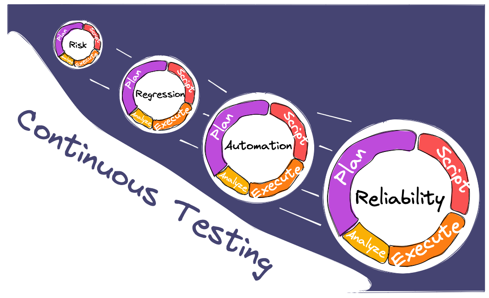

# High-level overview of the load testing process

In the last section, you learned about what load testing is, how it's different from performance testing, and what the different types of test scenarios are. In this section, you'll learn about the different phases of the load testing process:

- Planning for load testing
- Scripting a load test
- Executing load tests
- Analysis of load testing results

These activities are shown as distinct phases here for clarity; however, in practice, they often overlap. Just like when releasing applications, testing should be a continuous and Agile process, with each small increment building upon previous work and growing more and more robust over time.

Just like application code, a test starts off slowly at the peak of a mountain, at its simplest form. A test in its early stages could be thought of as primarily **risk-based**. Tests are written specifically to prevent failure in an application's most critical components, but there might not be enough time for anything else. Testing at this level is a reaction to probable failures.

As testing matures within the project, it may eventually start to include **regression**. Now that all the high-risk areas are covered, teams have time to make tests a bit more backward-compatible and preventative, and they write tests to see if new code breaks past functionalities.

The Continuous Testing Snowball gathers speed as the team grows along with the test suite, focusing on **automating** more and more parts of the testing process with every iteration or sprint. A repeatable framework is established. In this stage, the snowball is at its fastest speed.

At the bottom of the slope, continuous testing has evolved testing to such an extent that the team is able to expand their focus from addressing specific defects to increasing overall **reliability and confidence** in the application's ability to withstand unexpected events. The framework is made even more robust with more exploratory types of testing like [[Chaos Engineering]].

In Continuous Testing, the focus is on organically and iteratively evolving the testing suite in parallel with the application, starting with something small with the goal of making enough incremental changes until it is more robust.

## Planning for load testing

Planning for a load test is the first part of the process, and it involves identifying the reasons for testing, _what_ to test, and _how_, generally, to test it.

In this phase, we formulate requirements for load testing:
- Clarify scope of testing
- Define SLOs
- Identify workload models
- Set up environment for testing, including monitoring
- Agree on the frequency and schedule of tests
- Prepare test data, if applicable

Planning for any testing is a team activity, and load testing is no exception. This phase is an opportunity for all stakeholders to get together and understand what testing will look like, as well as what would define a successful round of testing.

## Scripting a load test

Scripting the load testing script involves translating the test plan into executable tests. In this phase, the following activities may be carried out:
- Create test scenarios that adequately cover the requirements
- Write test scripts using load testing tools
- Make scripts realistic
- Run a shakeout test to verify that the script works as expected
- Run tests against upstream environments, usually dev or staging
- Share test scripts with the team
- Set up a testing framework that can grow with the test suite

While tests may be executed while scripting, they are usually for debugging or shakeout purposes rather than full load tests. The scripting phase may spill into the test execution phase as changes are made to existing scripts or new scripts are made to address issues found during test execution.

## Executing load tests

During test execution, the load testing scripts are run against the intended environment, often a test environment or production. In test execution, you may do some of the following activities:
- Set up cloud or on-premise infrastructure
- Set up observability tools to monitor application server and load generator health
- Run shakeout tests to verify that test environments work as expected
- Run a baseline test to understand current system behavior
- Make changes to the code or environment and run tests to compare against the baseline test
- Increase the scope of tests
- Do distributed testing by ramping up or scaling out the load test

Executing load tests involves more than just running tests, because the tests themselves may not be helpful without proper observability tools in place to monitor the health of the system and the health of the test.

## Analysis of load testing results

During the analysis phase, you may do some of the following activities:
- Collate data from application servers as well as from load generators
- Aggregate data to be able to get a big-picture understanding of what happened during the test
- Use data visualization and analysis tools to determine how the system behaved under test conditions
- Report findings to stakeholders
- Remediate bottlenecks
- Rerun tests to confirm issues or fixes

Using the data collected during the test to understand how the system behaves during different test conditions is a big part of what makes load testing valuable. It's important to examine the data objectively and to communicate the results to the team in a comprehensible way.

## Continuous load testing

Continuous load testing is a practice that spans all the testing phases. It may include:
- Add load testing scripts into a version-controlled repository
- Incorporate load tests into a CI/CD pipeline
- Automate reporting
- Set up notifications for failed tests
- Set up a repeatable framework for running load tests that is tied into code changes or release cycles
- Capture test results in a database to be able to view historical trends

Without ensuring that load testing is done continuously, load testing can become a one-off process. Incorporating it into existing CI/CD pipelines keeps performance front-of-mind for everyone involved.

As the testing suite grows in maturity and scope, teams should naturally create more efficient frameworks for running tests, managing notifications, analyzing results, and reporting. In this way, testing can start very simply, usually around the most critical or high-risk functionalities of the application, and then evolve and improve organically along with the application.

## Test your knowledge

### Question 1

Which of the following statements is true?

A: Doing the activities is more important than having a clear distinction between phases of the load testing process.

B: The phases of the load testing process must always be done sequentially, so as not to miss any vital activities.

C: Planning for a load test is best done by test managers, who are in the best situation to understand what is required from load testing.

### Question 2

When is the best time to start thinking about load testing and observability tools?

A: Planning

B: Scripting

C: Execution

### Question 3

Why is continuous load testing important?

A: Automating load testing verifies system behavior over time.

B: Incorporating load testing into CI/CD pipelines means it's not necessary to hire specialized load testers.

C: Running load tests automatically stops developers from checking in code that is not performant.

### Answers

1. A. While it can be useful to think of distinct phases in testing to understand the process, in practice, testing should be tightly integrated with other activities in the software development lifecycle.
2. A. The testing and observability stack selected can have an impact on the type of testing you do and your testing results, so we recommend you consider your options as early as possible.
3. A. Incorporating load testing into continuous integration pipelines helps you see trends in performance over time.