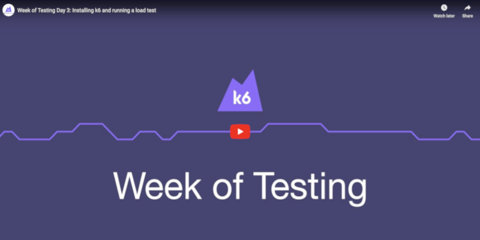

# Getting Started with k6 OSS

There are many ways to start scripting with k6, but we're starting with [k6 OSS](https://github.com/grafana/k6) for a few reasons:
- It is a fully-fledged load testing tool on its own, and it doesn't require a subscription or any payment to use.
- k6 Cloud, the SaaS platform, also uses k6 OSS, so the skills you learn in this section will apply even if you decide to use k6 Cloud later.
- You can add advanced scenarios and features to your k6 OSS scripts. The other methods of script generation that we'll discuss later are limited in functionality.

Let's get started!

## Installation

First, install k6 by [following the instructions here](https://k6.io/docs/getting-started/installation/) for your operating system.

Next, pick your favorite IDE or text editor. Many of us use and recommend [VS Code](https://code.visualstudio.com/), but you can also use [Sublime Text](https://www.sublimetext.com/), [Atom](https://atom.io/), or anything else you're already using that can create text files.

## Writing your first k6 script

Time to write the script!

k6 supports multiple protocols, but for now, let's stick to HTTP. Your first script will do a basic HTTP POST request against a test API that will echo back whatever you send to it.

The fastest way to create a k6 test is to use the `k6 new [filename]` command introduced in k6 version 0.48.0. This will automatically create a file with the basic boilerplate you need to get you up and running quickly. 

But, as part of your k6 learning, we will also teach you how to create a test manually.

Create a new file named `test.js`, and open it in your favorite IDE. This file is our test script. k6 scripts are always written in JavaScript, even though k6 itself is written in Go. We're going to create the script together, step by step. Copy and paste the code snippets as necessary, so that your script looks like the one here. 

Import the HTTP Client from the built-in module `k6/http`:

```js
import http from 'k6/http';
```

Now, create and export a default function:

```js
export default function() {
}
```

Any code in the `default` function is executed by each k6 virtual user when the test runs.

Add the logic for making the actual HTTP call:

```js
import http from 'k6/http';

export default function() {
  let url = 'https://httpbin.test.k6.io/post';
  let response = http.post(url, 'Hello world!');
}
```

Here, you're instructing k6 to send an HTTP POST request to the API endpoint `https://httpbin.test.k6.io/post` with the body `Hello world!`

You could actually run this script already, and k6 would make the HTTP POST request, but how would you know if it worked? Here's how to log the response to the console:

```js
import http from 'k6/http';

export default function() {
  let url = 'https://httpbin.test.k6.io/post';
  let response = http.post(url, 'Hello world!');

  console.log(response.json().data);
}
```

You'll learn more ways to verify the results of your tests later, but for now, go ahead and run your first test!

## Hello World: running your k6 script

Save your script in your editor. Then, open up your terminal and go to the directory where you saved your k6 script. Now, run the test:

```js
k6 run test.js
```

You should get something like this:

```plain
$ k6 run test.js

          /\      |‾‾| /‾‾/   /‾‾/
     /\  /  \     |  |/  /   /  /
    /  \/    \    |     (   /   ‾‾\
   /          \   |  |\  \ |  (‾)  |
  / __________ \  |__| \__\ \_____/ .io

  execution: local
     script: test.js
     output: -

  scenarios: (100.00%) 1 scenario, 1 max VUs, 10m30s max duration (incl. graceful stop):
           * default: 1 iterations for each of 1 VUs (maxDuration: 10m0s, gracefulStop: 30s)

INFO[0001] Hello world!                                  source=console

running (00m00.7s), 0/1 VUs, 1 complete and 0 interrupted iterations
default ✓ [======================================] 1 VUs  00m00.7s/10m0s  1/1 iters, 1 per VU

     data_received..................: 5.9 kB 9.0 kB/s
     data_sent......................: 564 B  860 B/s
     http_req_blocked...............: avg=524.18ms min=524.18ms med=524.18ms max=524.18ms p(90)=524.18ms p(95)=524.18ms
     http_req_connecting............: avg=123.28ms min=123.28ms med=123.28ms max=123.28ms p(90)=123.28ms p(95)=123.28ms
     http_req_duration..............: avg=130.19ms min=130.19ms med=130.19ms max=130.19ms p(90)=130.19ms p(95)=130.19ms
       { expected_response:true }...: avg=130.19ms min=130.19ms med=130.19ms max=130.19ms p(90)=130.19ms p(95)=130.19ms
     http_req_failed................: 0.00%  ✓ 0        ✗ 1
     http_req_receiving.............: avg=165µs    min=165µs    med=165µs    max=165µs    p(90)=165µs    p(95)=165µs
     http_req_sending...............: avg=80µs     min=80µs     med=80µs     max=80µs     p(90)=80µs     p(95)=80µs
     http_req_tls_handshaking.......: avg=399.48ms min=399.48ms med=399.48ms max=399.48ms p(90)=399.48ms p(95)=399.48ms
     http_req_waiting...............: avg=129.94ms min=129.94ms med=129.94ms max=129.94ms p(90)=129.94ms p(95)=129.94ms
     http_reqs......................: 1      1.525116/s
     iteration_duration.............: avg=654.72ms min=654.72ms med=654.72ms max=654.72ms p(90)=654.72ms p(95)=654.72ms
     iterations.....................: 1      1.525116/s

```

That's a lot of metrics! In the next section, we'll go over what each of these lines mean.

## Other resources

[](https://www.youtube.com/embed/y5tteMKZUqk)

## Test your knowledge

### Question 1

What's the best way to access the JSON body of an HTTP response?

A: `response.json()`

B: `response.body()`

C: `response.content`

### Question 2

What is the name of the built-in module that contains the HTTP client?

A: `http`

B: `k6/http-client`

C: `k6/http`

### Question 3

Where in a test script should we place HTTP calls to have them executed by a virtual user?

A: In the global scope

B: In an exported default function

C: In a function called `exec()`

### Answers

1. A. Using `response.json()` will not only get the response body but also parse the JSON.
2. C. `k6/http` is the module that needs to be imported in a k6 script if you want to use HTTP. The other two options do not exist.
3. B. Only code placed within an exported function (either the default one or one that is named in the `exec` option [of a scenario](https://k6.io/docs/using-k6/scenarios/#common-options)) will be executed by a virtual user.
