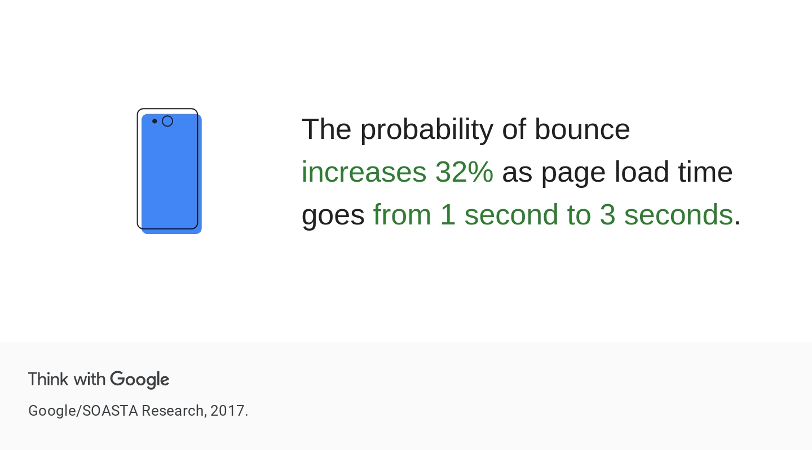

k6 encourages developers and testers to define goals for each test. To do this, you can set [thresholds](https://k6.io/docs/using-k6/thresholds) to evaluate whether the test performs to a certain criteria. As an example, you can use thresholds to assert that the system performs within your service-level objectives while the test runs.

You can also use Thresholds to determine whether a test passed or failed. Adding thresholds to a load-testing script is useful because it tells k6 to alert you when those thresholds are breached, or even stop the test. Having thresholds as part of the code makes it easier for other colleagues to step in and run the test.

If you'd like to run load tests within a CI/CD pipeline, you'll also want k6 to send non-zero exit codes so that failures are clearly recorded.

You can add thresholds to a k6 script in the Test Options object:

```js
export let options = {
  stages: [
    { duration: '30m', target: 100 },
    { duration: '1h', target: 100 },
    { duration: '5m', target: 0 },
  ],
  thresholds: {
    http_req_failed: ['rate<=0.05'],
    http_req_duration: ['p(95)<=5000'],
  },
};
```

Thresholds are always based on metrics. You can review the full list of [built-in metrics here](https://k6.io/docs/using-k6/metrics/#built-in-metrics).

Thresholds are expressed as a statement of what is expected:
- When threshold statements evaluate to `true`, the threshold is met and the test passes. The exit code that k6 returns is 0.
- When threshold statements are `false`, the threshold is not met, the test fails, and k6 returns a non-zero exit code.

## Types of thresholds

Below are the most common types of thresholds you can set. You can set multiple types thresholds in a single test:
- Error rate
- Response time
- Checks

**Testing best practice**: Use error rate, response time, and checks thresholds in your tests where possible.

### Error rate

```js
thresholds: {
    http_req_failed: ['rate<=0.05'],
},
```

To add a threshold for the error rate, use the metric `http_req_failed` and enter the error rate that you expect the test to fall within. By default, `http_req_failed` counts any HTTP 4xx and HTTP 5xx errors as a failure. You can change this behavior with [`setResponseCallback()`](https://k6.io/docs/javascript-api/k6-http/setresponsecallback-callback/).

The threshold above will be met only if the error rate during the test is less than or equal to 5%.

#### Rule of thumb: error rate

What's a good error rate? This depends on your test, script, test data, application, and end users' tolerance for error:
- For mission-critical applications, consider a lower error rate such as 1%.
- For auxiliary or non-critical applications, consider a higher error rate of 5%.
- For testing disaster recovery situations, where you're purposely terminating or restarting server nodes, an error rate of 10-15% may be acceptable.

### Response time

```js
thresholds: {
    http_req_duration: ['p(95)<=5000'],
},
```

In the example above, the response time threshold is set to a 95th percentile response time of 5000 milliseconds. This statement will be true if 95% of all HTTP requests have a response time of 5 seconds or less.

You can add a response time threshold using any of the metrics displayed in the [k6 end-of-test summary](03-Understanding-k6-results.md):

```plain
http_req_duration..............: avg=151.06ms min=151.06ms med=151.06ms max=151.06ms p(90)=151.06ms p(95)=151.06ms
```

That includes:
- average: `http_req_duration: ['avg<=5000'],`
- minimum: `http_req_duration: ['min<=1000'],`
- median: `http_req_duration: ['med<=3000'],`
- maximum: `http_req_duration: ['max<=6000'],`
- percentiles: `http_req_duration: ['p(95)<=5000'],`

**Testing best practice**: All of these metrics can be skewed by the presence of outliers in response time on either extreme, but if you don't know which one to choose, we recommend starting with the 95th percentile response time.

#### Rule of thumb: response time

[](https://www.thinkwithgoogle.com/marketing-strategies/app-and-mobile/page-load-time-statistics/)

[According to research by Google](https://www.thinkwithgoogle.com/marketing-strategies/app-and-mobile/mobile-page-speed-new-industry-benchmarks/), the probability of potential customers leaving your site increases by 32% when the response time increases to 3 seconds.

When in doubt, we recommend using a 95th percentile response time of 2 seconds as a starting point.

#### Using multiple response time thresholds

You can also string along multiple thresholds for the same metric in an array, and response time is a good candidate for this:

```js
thresholds: {
    http_req_duration: ['p(90) < 400', 'p(95) < 800', 'p(99.9) < 2000'],
},
```

The threshold above states that:
- 90% of all HTTP requests should have a response time lower than 400 ms
- 95% of all HTTP requests should have a response time lower than 800 ms
- 99.9% of all HTTP requests should have a response time lower than 2000 ms

> :warning: Specifying multiple thresholds for the same metric. If you want to include more than one threshold for the same metric, such as `http_req_duration` above, you **must** declare them in an array. The example below will NOT work, and will result in only the last line being used as a threshold:

```js
thresholds: {
  http_req_duration: ['p(90) < 400'],
  http_req_duration: ['p(95) < 800'],
  http_req_duration: ['p(99.9) < 2000'],
},
```

### Checks

As you learned in [Adding checks to your script](04-Adding-checks-to-your-script.md), failed checks are reported, but they don't affect the status of the test as a whole. If you want to make the test fail when a certain check error rate is reached, you can use a combination of checks and thresholds:

```js
thresholds: {
  checks: ['rate>=0.9'],
},
```

The threshold above states that 90% or more of all checks in the test should be successful. Otherwise, the test will fail.

## Aborting test on fail

There may be situations in which you would like the test to stop running if thresholds aren't met. For example, if a test has a very high error rate due to an application component being unresponsive, it may be better to stop the test and start troubleshooting the issue.

In these situations, you can extend the relevant threshold to tell k6 to abort the test if the threshold is not met. Instead of:

```js
thresholds: {
    http_req_failed: ['rate<=0.05'],
},
```

try this:

```js
thresholds: {
    http_req_failed: [{
      threshold: 'rate<=0.05',
      abortOnFail: true,
    }],
},
```

The extra parameter `abortOnFail: true` instructs k6 to stop the test (without a [graceful stop](https://k6.io/docs/misc/glossary/#graceful-stop)) as soon as the threshold is crossed. In this case, that happens when the error rate goes over 5%. k6 will display the end-of-test summary report with an error that looks like this:

```plain
ERRO[0012] some thresholds have failed 
```

and you'll know that the test aborted due to a threshold failure.

## Run it yourself!

Your script should look something like this:

```js
import http from 'k6/http';
import { check, sleep } from 'k6';

export let options = {
  stages: [
    { duration: '30m', target: 100 },
    { duration: '1h', target: 100 },
    { duration: '5m', target: 0 },
  ],
  thresholds: {
    http_req_failed: [{
      threshold: 'rate<=0.05',
      abortOnFail: true,
    }],
    http_req_duration: ['p(95)<=100'],
    checks: ['rate>=0.99'],
  },
};

export default function() {
  let url = 'https://httpbin.test.k6.io/post';
  let response = http.post(url, 'Hello world!');
  check(response, {
      'Application says hello': (r) => r.body.includes('Hello world!')
  });

  sleep(Math.random() * 5);
}
```

Copy the script, save it, and do a `k6 run test.js` to run the test with thresholds.

## Test your knowledge

### Question 1

Your team has decided to aim for a 95th percentile response time of 2 seconds. What is the best way to express this as a threshold?

A: `http_req_duration: ['p(95)>2000'],`

B: `http_response_time: ['avg<=2000'],`

C: `http_req_duration: ['p(95)<=2000'],`

### Question 2

Your test script has the following threshold defined in the test options:

```js
thresholds: {
    checks: ['rate>=0.99'],
},
```

The test runs for 100 iterations of 1 HTTP request each. 3 of the HTTP requests fail the check. Which of the following outcomes would you expect?

A: The test will abort on failure of the check threshold.

B: The test will run to completion and will be marked as a success because check failures do not fail tests.

C: The test will run to completion, but there will be an error that some thresholds have failed.
### Question 3

Your test script has the following threshold defined in the test options:

```js
thresholds: {
	http_req_failure: ['rate<=0.05'],
	http_req_failure: ['rate<=0.03'],
	http_req_duration: ['p(90)<4000'],
}
```

Which of the following statements is true?

A: The test will fail if the error rate is 5% or higher.

B: The test will fail if the error rate exceeds 3%.

C: The test will pass if the 90th percentile response time is 4 seconds.

## A note on thresholds

Thresholds are useful as initial indicators of the success or failure of a test run. However, they should not be used as the _only_ way to assess a test.

The main limitation of thresholds is that they're based on metrics, and metrics can be heavily influenced by the presence of a handful of outlier measurements that are either extremely low or extremely high.

Metrics like percentiles do a slightly better job at describing where measurements fall, but there's no replacement for graphing each of those measurements and seeing the shape of the distribution of the data for yourself.

The problem is that k6 OSS doesn't produce graphs natively. In the next section, you'll learn about how to output results for use in your results visualization tool of choice.

### Answers

1. C. Thresholds are expressed in terms of what would cause them to pass, so C is the correct answer because it describes a test whose 95th percentile response time is less than (faster than) or equal to 2000 ms, or 2 seconds. Anything beyond this would cause the threshold to fail.
2. C. Thresholds don't abort tests on failure [unless `abortOnFail` is set to `true`](https://k6.io/docs/using-k6/thresholds/#aborting-a-test-when-a-threshold-is-crossed), so only C is correct. The test will still go through the execution, but a message will be displayed in the end-of-test summary to say that some thresholds have failed.
3. B. A is incorrect because when contradicting thresholds are defined, the last one will be used, so the threshold on `http_req_failure` will be set to 3% rather than 5%. C is incorrect because the threshold is set to pass if the response time is *less than* 4 seconds, so a 4-second response time will cause it to fail.
