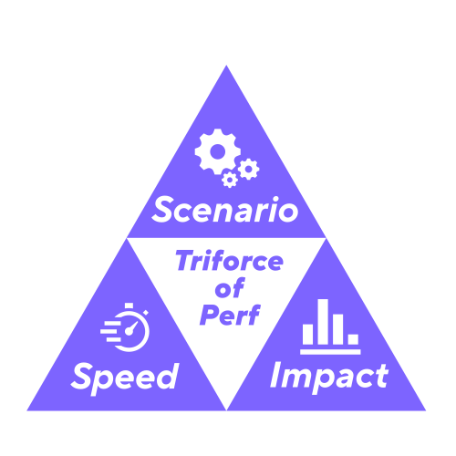

# What is performance testing?

Let's start explaining what performance testing means by defining it word by word. Here are some dictionary-paraphrasing definitions of each word.

>**Performance**
>Refers to the capabilities (how good, fast or efficient) of a machine, vehicle, or product, when observed under particular conditions.

>**Testing**
>To take measures to check the quality, performance, or reliability of (something), especially before putting it into widespread use or practice.

When both words and definitions pair up, the meaning of the practice goes something like the following.

>**Performance Testing** 
>It is the act of measuring, validating, or checking a machine, vehicle, or product's capabilities (stability, speed, and efficiency) when observed under particular conditions. 

In this writing, we will be talking about _Software_ Performance Testing for our interests, referring to it as just Performance Testing. 

In other words, Performance Testing is a branch of software testing whose primary concern is verifying _how well_ a system works instead of _if_ it works (the focus of the functional testing practice). 

## Beware: performance testing is not load testing

A common misconception is to use the terms performance-testing and load-testing interchangeably.

**They are not the same thing.**

We will get into more detail in the next section. But, as a quick clarification, Load testing is a sub-practice of performance testing.

Performance testing measures performance under many circumstances, and load focuses on measuring performance while the system is under load.

  

# What’s the deal with the performance?
Performance testing focuses on three main elements.

-  **_Time_**: It measures the responsiveness of the solution after an event is triggered. In other words, how fast the system reacts to that event. In other words, how fast it reacts to an event (and there are many events, not just user actions and load.)

-  **_Efficiency_**: Another interest is to measure the system's impact after the given event. Common measurements can be computer resource consumption (CPU, RAM, etc.) and measurable metrics (temperature, number of connections, data transfer, etc.)

-  **_Scenario_**: These are the particular conditions stated in the definition. Performance testing measures the speed and impact during a particular event or scenario. Some events or scenarios are RUM (Real User Monitoring), instrumentation, load tests, single-user tests, no-user tests, and many more.

Creating scenarios is integral to the performance-testing trade. Teams must figure out ways to stimulate or trigger those specific circumstances or scenarios. The ways to simulate the scenarios goes from manual, automated, continuous triggering (synthetics), and even no actions.
 

# Why should we do performance testing?

Performance testing goes beyond functional tests, which verify that the software does what it is supposed to do. Performance testing assumes that the software already does what it is supposed to; instead, it focuses on how well it does it.

Again, performance testing verifies how fast and efficient the software is. 

If the teams do not validate that the processes in our software respond quickly and efficiently (without consuming or holding too many resources), they face multiple risks: 

*  **Slow software**. That is, when the software doesn't respond fast enough. Slow software impacts how much work can be done and, eventually, the end-user. The most common types of end-user are external (clients) and internal users (employees). 

	An internal user affected by slowness will experience the following problems:
	
	- Low prod+uctivity
	- Frustrations
	- Dislike of their work on the system
	- Low morale
	
	Similar problems will appear in customer-facing solutions: 
	
	- Lower sales
	- Lost sales 
	- Lost customers due to frustration
	
	Those translate into monetary losses regarding customers, productivity, and even public image.

* **Expensive to run/host**. When we do not test resource consumption, the costs for the software can escalate quickly.

* **Uncertain/low capacity** High resource consumption limits the capacity to serve multiple concurrent users. Inefficient software drains computing resources when more users engage the solution. That limits the software's ability to serve higher user volumes. It will be easy to reach the system's limits where the processes slow down or become unresponsive, losing users, sales, and capacity. 

* **Availability** A considerable concern—an intersection of performance testing and SRE. If we do not test the system's efficiency, it will be prone to failures and even offline time. While offline, the system will ultimately prevent any work or even conducting any business.

* **Fix costs** Resolution costs increase considerably without performance testing. The above problems will appear, and a fix will be required when the application ultimately experiences any of those issues. The usual adage applies here; the latest a problem is detected, the more costly the impact and resolution will be.

  
With the right audience, you could add examples from the real world to illustrate these. At least there have been plenty of highly public availability incidents.  

Ultimately, performance testing helps determine whether the user will have a reliable and fast experience in the developed application. To skip performance testing is to dismiss the user's experience.

As you can see, performance testing is priceless and avoids multiple losses. Then, why don't more teams do it? 

## Common excuses for not doing performance testing
Below are common reasons why teams decide not to test performance and mitigate performance-related risks.

### Plain ignorance
They do not know that they should include performance testing in their software development process. And if organizations know or infer that it is crucial, they may not know how to embrace it.

  

### Our application is too small ... we don't need it
The idea that only large corporations or complex applications require performance testing mainly stems from the misconception that performance testing equals load testing; to simulate hundreds or even thousands of users. In fact, even when an application has a single user or just a handful, there are significant benefits to measuring its performance. . It can be dangerous only to performance test applications that serve large volumes of users. Costly performance inefficiencies can also exist in small systems.

### It's expensive or time-consuming
Many feel that doing performance testing _can_ be expensive and time-consuming. Anything can feel overpriced if you depart from the null cost of not doing performance testing. 

That may seem like savings at the moment. But as stated earlier, the cost of not doing it can be far greater than the investment needed to implement performance testing practices. Health insurance seems expensive until we don't have it during an accident.

  

### It requires extensive technical knowledge
There are different types of performance testing, and some require more technical knowledge than others. However, performance testing is no more or less complex than other forms of testing. Teams can choose from a spectrum of performance testing activities according to the nature of the solution and its risk profile. Accessing a web page while looking at timings from the browser's DevTools' Network panel is performance testing that adds immediate value for little effort.

On the other hand, bringing a person with extensive technical knowledge is always worth it if the solution poses expensive performance risks.

  

### We don't have a performance environment
Again with the confusion between Performance and load testing. Many believe that to test the application's performance; there must be a dedicated environment to overload it, break it if required, and do all that violence without interfering with others.

Performance testing doesn't always have to mean load testing, and even load testing doesn't mean stressing the application to its breaking point. Most opportunities to assess Performance and catch issues don't require massive load tests or dedicated performance testing environments: unit tests for Performance during development, API tests during System testing, and synthetic monitoring or low-load tests in production.

  

### We have observability, no need for performance testing
The development of mature observability platforms encourages many to forego performance testing in favor of monitoring application performance in production. However, observability's efficacy depends on having data to observe, which comes from user actions. We can observe application performance only when the users are active in the system. But if a blockage happens and the users get off of the system, monitoring will not be able to measure performance if there is no one working.

Performance testing lets teams simulate rich user scenarios _before_ potential performance issues are released to production and even after the software reaches production. If no user activity is present in the system, you will still receive information about your processes' Performance through performance tests. 

>*NOTE*: Observability is still excellent as a first-line to measure performance metrics in the system. Pairing observability with performance tests is the best combination. None is better than the other, and both should always be present.

  

### No need; the cloud is infinite
The cloud may be infinite, but your checking account is not. Pushing new code into the cloud can be very expensive, if you trust that the only way to stay performant is to expand. Also, not all the performance problems are solved by increasing resources.

A system that performs poorly (consumes lots of resources) is like an old fridge. It may still be running fine, but it for sure consumes more electricity than a modern fridge. You will notice a difference when you get the power bill. The same happens with applications in the cloud; if they are not Performance tested and tuned, you will receive expensive bills!
