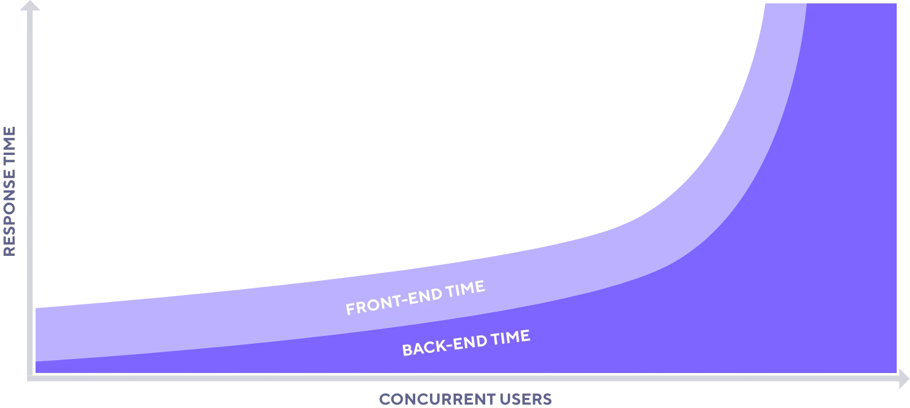

# What is performance testing?

The primary concern of performance testing is _how well_ a system works.
Unlike functional testing, which tests _whether_ a system works, performance testing seeks to measure qualitative aspects of a user's experience of a system, such as its responsiveness and success rate.

For a holistic view of performance, testers need to test both the front and back ends of an application. Though there is some overlap in the tools and techniques, the approach and focus differs when testing different application parts.

### Frontend performance testing

Frontend performance testing verifies application performance on the interface level, measuring round-trip metrics that consider how and when page elements appear on the screen.
It is concerned with the end-user experience of an application, usually involving a browser.
Frontend performance testing excels at identifying issues on a micro level but does not expose issues in the underlying architecture of a system.

Because it primarily measures a single user's experience of the system, frontend performance testing tends to be easier to carry out on a small scale.
Frontend performance testing has metrics that are distinct from backend performance testing. Frontend performance tests for things like:
- Whether the pages of the application are optimized to render quickly on a user's screen
- How long it takes a user to interact with the UI elements of the application.

Some concerns when doing this type of performance testing are its dependency on fully integrated environments and the cost of scaling. You can test frontend performance only once the application code and infrastructure have been integrated with a user interface. Tools to automate frontend testing are also inherently more resource-intensive, so they can be costly to run at scale and are not suitable for high load tests.

### Why isn't frontend performance testing enough?

Since frontend performance testing already measures end-user experience, why do we even need backend performance testing?

Frontend testing tools are executed on the client side and are limited in scope. They do not provide enough information about backend components for fine-tuning beyond the user interface.

This limitation can lead to false confidence in overall application performance when the amount of traffic against an application increases. While the frontend component of response time remains more or less constant, the backend component of response time increases exponentially with the number of concurrent users:

Testing only frontend performance ignores a large part of the application, one more susceptible to increased failures and performance bottlenecks at higher levels of load.

### Backend performance testing

Backend performance testing targets the underlying application servers to verify the scalability, elasticity, availability, reliability, and responsiveness of a system as a whole.

- *Scalability*: Can the system adjust to steadily increasing levels of demand?
- *Elasticity*: Can the system conserve resources during periods of lower demand?
- *Availability*: What is the uptime of each of the components in the system?
- *Reliability*: Does the system respond consistently in different environmental conditions?
- *Resiliency*: Can the system gracefully withstand unexpected events?
- *Latency*: How quickly does the system process and respond to requests?

Backend testing is broader in scope than frontend performance testing.
API testing can be used to target specific components or integrated components, meaning that application teams have more flexibility and higher chances of finding performance issues earlier. Backend testing is less resource-intensive than frontend performance testing and is thus more suitable for generating high load.

Some concerns when doing this type of testing are its inability to test "the first mile" of user experience and breadth. Backend testing involves messaging at the protocol level rather than interacting with page elements. It verifies the foundation of an application rather than the highest layer of it that a user ultimately sees. Depending on the complexity of the application architecture, backend testing may also be more expansive in scope.

## Why should we do performance testing?

With performance testing, your team can:

- **Improve user experience.** Identify potential bottlenecks and issues early in the development process. Performance testing provides a complete picture of what the experience of a user accessing your application is like, beyond just the application functionality.
- **Prepare for unexpected demand.** Test beyond expected load to find the breaking points of the application and formulate better procedures for responding to and capitalizing on unprecedented success.
- **Increased confidence in the application.** Lower the overall risk of failure with systematic performance testing. This reduced risk also builds team confidence. Teams can work knowing their application can withstand unexpected conditions in production.
- **Assess and optimize infrastructure.** Reduce unnecessary infrastructure costs without compromising performance. Simulate scenarios to observe horizontal and vertical scaling, and run experiments to verify the resources that the system under test actually requires.

If performance testing is so valuable, why don't more teams do it?

## Common excuses for not performance testing

These concerns are often rooted in misconceptions about the necessary cost and complexity of testing performance.

### Our application is too small

The idea that only larger corporations or more complex applications require performance testing stems mostly from the misconception that performance testing needs to simulate hundreds or even thousands of users. In fact, measuring how a system performs with just a handful of users can bring significant benefits. Even simulating a single user could highlight bottlenecks in the application that would not have otherwise been spotted. Costly performance inefficiencies can also exist in small systems.

### It's expensive or time-consuming

Performance testing *can* be expensive and time-consuming, but teams can pick and choose the type of activities that fall within their budgets for cost and time. The cost of _not_ performance testing is often far greater than the initial investment in some performance-testing practices.

### It requires extensive technical knowledge

Different types of performance testing require more different degrees of technical knowledge. On its face, however, performance testing is no more or less complex than other forms of testing. Teams can choose from a spectrum of performance-testing activities according to their appetite for complexity. Accessing a web page while looking at timings from the Network panel of DevTools within a browser is a type of performance testing that adds immediate value for little effort.

### We don't have a performance environment

Performance testing doesn't always mean load testing, and even load testing doesn't always involve stressing an application to its breaking point. Some ways to assess performance don't require dedicated performance-testing environments, for example:
- Unit tests for performance during development
- API tests during System testing
- And synthetic monitoring or low-load tests in production.

### Observability trumps performance testing

Having a mature observability platform encourages many to forego performance testing in favor of monitoring application performance in production. However, the efficacy of observability depends on having data to observe, and without the ability to generate data artificially, application performance is often observed only after bottlenecks are already live.

With performance testing, teams can simulate rich user scenarios *before* potential performance issues are released to production, making observability useful in test environments as well. Some types of tests, such as disaster recovery, chaos engineering, and reliability testing, also help teams prepare for inevitable failures.

Both performance testing and observability are essential components to improving the quality of a system.

### The cloud is infinite; we can always scale up

Now that many applications are hosted in the cloud, it can be tempting to think that horizontal or vertical scaling negates the need to test performance. However, this belief can lead to significantly increased costs if efficiency is not taken into account.

Scalability is only *one* aspect of application performance that should be tested. Even efficiently scaled systems can be slow or prone to failure and outages that render the application unusable. In fact, scaling systems up can exacerbate some types of cascading failures, like retry storms and the thundering-herd problem.

## Beware: performance testing is not load testing

A common misconception is that the term "performance testing" is interchangeable with the term "load testing." In the next section, you'll learn about what load testing is and how it differs from performance testing.

## Test your knowledge

### Question 1

Which type of testing does k6 excel in?

A: Backend testing

B: Manual testing

C: Accessibility testing

### Question 2

Which of the following is an advantage of backend performance testing?

A: It provides metrics like Time To Interactive (TTI) that measure when users can first interact with the application.

B: It simulates users by driving real browsers to test the application.

C: It can target application components before they're integrated.

D: A and B.

### Question 3

Which of the following statements is true?

A: Performance testing is always about generating high user load or traffic against application servers.

B: Performance testing is an activity that requires specialized expertise to carry out.

C: Performance testing requires a production-like environment.

D: Observability and performance testing are complementary approaches to improving application quality.

### Answers

1. A. k6 excels at backend performance testing. With xk6-browser, it does have a frontend performance testing capability, but accessibility testing is not yet possible.
2. C. A and B are both incorrect because they apply to frontend performance testing.
3. D. A is incorrect because performance testing can be done at lower load levels. B is incorrect because anyone can do  performance testing, not just specialized performance testers. C is incorrect because performance testing can be done in development, staging, and test environments as well.

