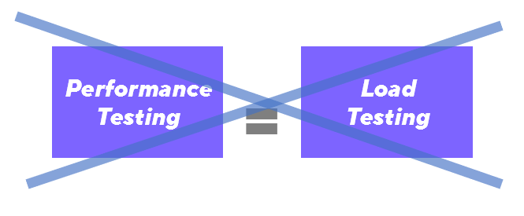

# Load Testing

A common mistake in the industry is to use the terms *performance testing* and *load testing* interchangeably. In fact, load testing is a sub-practice of performance testing.

[Performance testing](Introduction%20to%20Performance%20Testing.md) verifies how well a system works as a whole, including aspects such as scalability, elasticity, availability, reliability, resiliency, and latency. Load testing is just one type of performance testing, and it is an approach that can be used to test many of the aspects of application performance. However, not all performance testing involves load testing.




Load testing specifically focuses on verifying and validating the performance of an application while it has a significant volume of tasks to process. Load testing can be done manually, but most teams write automated load testing scripts to programmatically simulate real users accessing the application.


## Test parameters

When writing load testing scripts, there are many factors to consider beyond just the sheer amount of load that needs to be generated. These factors are called test parameters, and include the distribution, shape, and pattern of the load rather than just the amount.

Below is a non-exhaustive list of some common test parameters.

- **Virtual users (VUs).** The sum of the concurrent VUs used in the scenario.
- **Iterations.**  The total number of iterations to be executed.
- **Throughput**. The test throughput is a measure of how much load the test generates over time, usually defined in terms of VUs per second, requests per second or iterations per second.
- **User flows.** A user flow defines which actions the script will carry out, and in what order. In general, a user flow represents the path of a real user through the application.
- **Load profile.** A load profile describes the shape of the traffic generated by the test over time. It includes the number of delays (in the form of think time), ramp-up and ramp-down periods when the test gradually increases or decreases the amount of VUs over time, and stages of the test.
- **Duration.** The time it takes to run each stage of the test, as well as the entire test.


# Load test scenarios

A load test scenario is a combination of specific values of test parameters under which the load test will be executed. Each scenario recreates a certain situation or set of conditions that the application will be exposed to.

Load test scenarios are often called "types of load tests". Some of the most common scenarios are listed here.

## Shakeout Test

A shakeout test is a small test with one or few VUs that run for a shorter amount of time. It is typically executed before ramping up to larger tests as a way to test the waters and check for major issues such as:
- script-related problems that would significantly impact the accuracy of test results
- environment configuration not being as expected
- significant application performance bottlenecks even at low load

If a shakeout test fails, any revealed issues must first be resolved before continuing to ramp up the test throughput.

_Example:_


```
Name: Shakeout Test
Total VUs: 5	
Ramp-up: 0 seconds	
Duration: 10 minutes
Ramp-Down: 0 seconds
```


A shakeout test can also consist of [multiple scenarios](Workload%20modeling%20with%20scenarios.md).

## Regression Load Test

A regression load test is similar in load profile to the shakeout test, but its purpose is to verify whether recent changes to the application code have affected application performance.

Regression tests are executed after changes are made, and are good candidates for continuous load testing within a [CI/CD](Performance%20Testing%20Terminology.md#CI%20CD) pipeline so that no manual intervention is required to execute them. Regression tests are small in terms of load and duration, but they are ideally run frequently and provide a good idea of an application's performance over time in response to different builds.

Regression tests tend to be more limited in scope compared to other types of tests, as they verify only the most commonly used or high-risk functionalities rather than full user flows.

## Average Load Test

This scenario simulates the system's user workload during a typical hour in production. The scenario includes the most frequently executed requests or functionalities within that hour.

This test scenario typically includes ramp-up and ramp-down periods to simulate users gradually logging in and interacting with the system. The load test gradually increases the number of VUs until it reaches the desired load to mimic the average load behavior in production. 

Between the ramp-up and ramp-down periods is a steady state. After that, the test maintains the total load simulation for an hour or so. The steady state is any period of time during the load test where the number of virtual users is constant.

_Example_:


```	
Name: Average Load Test
Total VUs: 100	
Ramp-up: 30 minutes
Steady state: 60 minutes
Ramp-down: 10 minutes
Total duration: 100 minutes
```

In the example above, the average load test was defined in terms of the number of VUs, but it can also be defined in terms of the number of iterations or requests per second that the test generates. For more information, see [Setting load profiles with executors](Setting%20load%20profiles%20with%20executors.md).

## Stress Test

The stress test, also known as the peak load test, simulates the traffic that the application is expected to experience at the *highest* point of the day or season. While the average load test simulates the traffic on a typical day, aggregated over a week, month, or more, a stress test focuses on the highest amount of traffic that the application experiences.

A stress test is similar to an average load test in its shape, but usually generates a far higher test throughput than the average load test does. For example, an application that typically has 100 users accessing it on a regular day, but 300 users during the lunch hour might benefit from being tested with a stress test at the 300 VU level.

Stress tests are a good test scenario to use when testing rush hours or sale periods where the application faces heavier-than-normal load.

## Soak or Endurance Test

Soak tests, also called endurance tests, are tests with a longer duration than average or peak tests. Some performance bottlenecks are only apparent during longer periods of time, such as those caused by defects in memory management. Soak tests verify whether there is performance degradation over time.

This scenario tends to have similar test throughput levels to the average load test, but it is extended to a duration of several hours or even days, depending on the application. 
  

_Example_:


```		
Name: Soak Test
Total VUs: 50
Ramp-up: 30 minutes
Steady state: 480 minutes
Ramp-down: 10 minutes
Total duration: 520 minutes (8 hours and 40 minutes)
```

## Spike Test

The previous types of tests have all recreated a situation where load is introduced gradually (such as in the case of the average, stress, and soak tests) or where a small amount of load is executed (shakeout). A spike test, on the other hand, recreates a situation where the application experiences a *sudden* and massive increase in traffic. 

Spike tests can be used to verify application performance during times when traffic goes from low to extremely high in a short amount of time. Spike tests are good for simulating timed events like:
- prominent product announcements (like in a super-bowl ad)
- product launches or sale of concert tickets
- deadlines (last days of tax submissions)
- opening of sales seasons (Black Friday or Cyber Monday)

Generally, spike tests have little to no ramp-up period compared to other test scenarios, high throughput, short steady state duration, and a quick ramp-down period.

Another difference from the previous scenarios is the selection of user flows to be tested. A spike test usually focuses on one user flow that is prioritized over the others instead of the usual day-to-day processes. For example, in an event ticket sale, users may focus on purchasing a ticket over browsing other pages.

_Example_:


```
Name: Spike Test	
Total VUs: 300
Ramp-up: 1 minute
Steady state: 20 minutes
Ramp-down: 5 minutes
Total duration: 26 minutes
```


## Breakpoint Test

While most load test types so far simulate realistic and expected production load, breakpoint tests attempt to go one step further. A breakpoint test exposes an application to increasing levels of load in an attempt to identify the traffic level at which performance begins to degrade.

Breakpoint tests build confidence in what a system can handle and results from these types of tests provide valuable inputs for capacity planning.

A breakpoint test scenario focuses on the ramp-up period more than other scenarios. It can consist entirely of a gradual ramp-up, or it can consist of periods of ramp-up followed by periods of steady state. The stepped load profile pattern in the example below allows you to more closely correlate degraded performance with specific levels of load.

_Example_:


```
Name: Breakpoint Test	
Total max VUs: unknown
Ramp-up: 10 minutes before each stage
Steady state: 30 minutes
Ramp-down: 0 minutes
Total duration: unknown
```


Because breakpoint tests are more exploratory in nature, it is not known in advance how many maximum VUs will be executed or how long the test will last. Teams typically monitor an application closely while a breakpoint test is running and either stop the test manually or program it to stop when it exceeds certain [thresholds](Setting%20test%20criteria%20with%20thresholds.md).

## Test your knowledge

### Question 1

Which of the following statements about performance best practices is true?

A: The load test scenario selected can significantly impact the accuracy of test results. 

B: The best way to do performance testing is to simulate the peak load of users that would access the application in production.

C: The number of virtual users in a test is the most important test parameter in a scenario.

### Question 2

Which of the following test scenarios should you use for your first test execution on a new application and environment?

A: Soak Test

B: Shakeout Test

C: Regression Test

### Question 3

Which of the following test scenarios would be best suited for testing a memory leak?

A: Stress Test

B: Soak Test

C: Average Load Test

### Answers

_A, B, B_