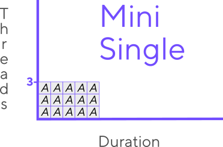
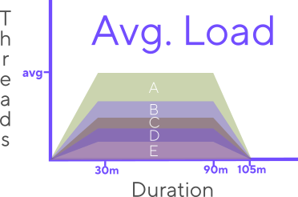
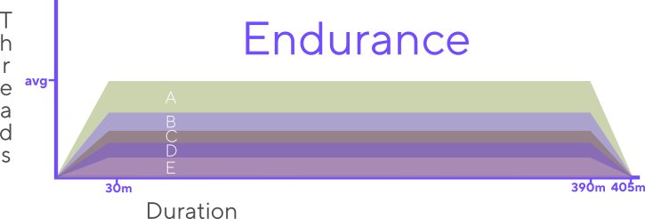
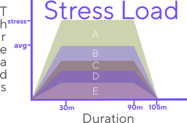
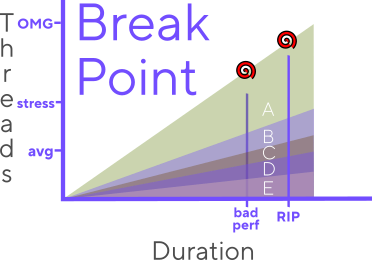
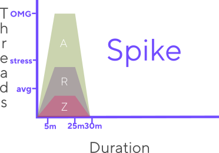

# Load Testing 

## A starting note

A common mistake in the industry is to use the terms Performance Testing and Load Testing interchangeably. Load testing is a sub-practice of Performance testing.

[Performance testing](Introduction to Performance Testing) includes every task that validates the speed and efficiency of software under diverse circumstances. Load testing is just one of the parts of performance testing.


## Then... what is load testing?

The term "load testing" refers to a sub-type of performance testing that focuses on verifying and validating software performance when it receives considerable volumes of work/tasks to process.

Many organizations undermine the importance of load testing. They just want to release the solution into production. But what can happen if the solution is released without any load testing or base performance testing, especially if the application expects to receive multiple user interactions?

## Reasons for load testing

Load testing focuses on determining the impact of extensive use (load) over the application's performance (speed and resources.)

*- The most significant risk that load testing tries to identify is slowness or unresponsiveness when the high load use scenario occurs.*

The efficiency of the application's resource usage and the point where the speed and responsiveness degrade go hand-in-hand. If the application is not efficient, it may not handle the expected loads. That is why "efficiency" is one of the performance testing practice's core elements and a crucial validation for load testing. 

Slow, unresponsive, or unavailable applications have multiple impacts. We have the same that we defined in [[Introduction to Performance Testing]] 
As a small resume:
- Lower or lost sales
- Low or lost productivity
- Angry users/customers
- High costs when the above happens
- High costs of fixing issues

But on top of those, problems will happen when the application receives the heaviest use, in other words, when needed the most. That will increase exponentially the problems listed above.


# How to load test
We load-test a system to observe and validate how it will behave or endure (survive) a significant volume of interactions. If there is an identified risk when the system is under load, load testing generates a load similar to the pattern identified as a risk scenario.

There are two main concerns when working on a load test. 
1. The ways or means to generate or simulate the load. 
2. The type of load to simulate, also known as **scenarios**. 

Let's check #1 first.

## Ways to load test

Load testing consists of generating (simulating) the specific loaded use of the system that poses a risk to measure and observe how and if it will endure the load and keep timely responses. The performance testing team has two main ways to simulate those risky load patterns.

1.  **Manual**. Contrary to common beliefs, there are multiple ways to do load testing with real people. Manual load testing falls in the realm of Shift-Right testing techniques. We will not get in-depth about it. But beware, as it is a valuable technique for performance testing in productive and pre-productive environments.
2.  **Automated.** The first thing most people think when they hear "performance testing." Automation is a programmatical computer simulation of real-user interaction with the system. In other words, we use programs to interact and make the system think it is responding to human requests.

Again, we will not go deep into manual load testing... For now. 

This section will focus on the types of loads that we can simulate with synthetics or automated load tests. In other words, automated load scenarios.


# Load test scenarios

A scenario is a combination of actions to execute in a system and how much to execute each action.

Scenarios can combine multiple mixes and behaviors. They can simulate only one action or process; or mix many different ones, pushing different loads, durations, and mixes. There are many types of scenarios that we can create through some main parameters.

The following parameters will generally define the scenarios:

-   **Name**. Silly as it sounds, the scenarios need to distinguish themselves clearly.
-   **Total threads/VUsers.** The sum of the VUsers used in the scenario.
-   **Processes.** A list of the processes or scripts to execute. Each process must come with a few specifications:
	-   **Iterations.** the Total number of iterations per hour. It could be defined in total or per VUser as well.
	-   **Threads/VUsers:** The number of concurrent threads that run the given process.
-   **Ramp up.** The period in which the number of threads or iterations will increase until reaching the desired amount.
-   **Load duration.** The amount of time that threads and throughput will not change once the test reaches the desired number of VUsers or throughput.
-   **Ramp down.** It is the duration of a gradual stop of the threads or volumes of action. Scenarios could stop tests instantaneously, but generally, load tests stop gradually.
-   **In-test variations.** It is generally not recommended, but in some situations, the teams may wish to change the volumes of actions or VUsers more than once after they reach the desired threshold.
-   **Total test duration.** An approximation of the total duration of the test from beginning to end.

Let's go over some of the most common scenarios tested in load simulations. These vary the parameters described above.

**_Note_**: There is no standardized naming convention for these common scenario types. The names here are descriptive, and some organizations may name them differently.

**_Note 2:_** Trying to test scenarios that vary too much or have crazy patterns is unwise, as identifying a source for a problem may become hectic. There is a standard set of load test scenarios that teams traditionally run one at a time to validate defined risk sources without complicating the analysis of the results.

Let's go over the most traditional types of load tests.

## Mini Load - Single process

This scenario is intended more as a safe check than an actual load test. But it counts as it uses concurrency. It clears out the risk of a single process having a poor performance at low utilization volumes.

The automation created to test it is very straightforward. It simulates a single process, with few iterations and few threads or virtual users. A usual recommendation is to have five to ten iterations with three to five threads.

This type of test validates new/updated code as it moves towards production. It is a rapid test that gives early indications of performance degradation under small loads for each new, updated or impacted component.

Teams can also use this scenario-type as synthetics for monitoring. The scenario is triggered periodically to check that production systems are not experiencing issues or significant performance degradation in that single process.

  

_Example_:
	

```
Name: MiniSingleLoad	
Total threads: 3	
Processes: 	
	Process-A, 3 threads, 5 iterations per thread	
Ramp-up: 0 seconds	
Full load: as long as it takes, no wait time	
Ramp-Down: 0 seconds
```

  

## Mini Load - Concurrent process

This type of scenario executes different single-process mini-load tests together. It executes relevant test processes simultaneously to assess rapidly the risk of any of those processes degrading the performance of the others. These quick executions should run in each environment the code flows toward production. Nevertheless, it is generally done in the last pre-productive environment to avoid releasing conflicting processes into production. This scenario is also executed in the production environment after the new code is released to assess that there is no performance impact in production.
  

_Example_:
	

```	
Name: MiniConcurrentLoad	
Total threads: 3x3 = **9** (# of threads times # of processes)	
Processes: 
	Process-A, 3 threads, 5 iterations per thread
	Process-B, 3 threads, 5 iterations per thread
	Process-C, 3 threads, 5 iterations per thread	
Ramp-up: 0 seconds	
Full load: as long as it takes, no wait time	
Ramp-Down: 0 seconds
```
  

## Average Load

This scenario simulates the system's user workload during an average production hour. The scenario includes the most frequently executed processes during that hour and aims to trigger each process accordingly. 

In real life, the activity in the system does not start all at once. Users gradually log in and interact with the system. The load test gradually increases the number of actions or threads until it reaches the desired load to mimic the average load behavior. 

After that, the test maintains the total load simulation for an hour or so. Depending on the size of the test, some organizations run the target load for 30 minutes, 60 minutes, or even 90. The duration is heavily dependent on the goal of the test, but the most common is an hour.

After the hour of full-load, the test ramps down gradually.

  

_Example_:
	

```	
Name: AverageLoad	
Total threads: 53 (sum of all threads)	
Processes: 	
	Process-A, 10 threads, 10 iterations per thread/hour	
	Process-B, 15 threads, 12 iterations per thread/hour	
	Process-C, 5 threads, 100 iterations per thread/hour	
	Process-D, 20 threads, 30 iterations per thread/hour	
	Process-E, 3 threads, 10 iterations per thread/hour	
Ramp-up: 30 minutes	
Full load: 60 minutes	
Ramp-Down: 15 minutes	
Total duration:~105 minutes  
```


## Endurance
A common requirement for centralized systems is that they must be active and responsive 24/7. Risks occur if there are problems with memory management, the performance may degrade after extended periods or have sudden alterations when the system restores memory.

This scenario is almost the same as the average load test. The only difference is that it has a considerably longer full-workload duration. The test aims to verify how the system will do over extended periods. 

Some teams avoid the average load test and run just the endurance test since it is identical to the average load scenario. They leave it running if it does well during the same period as the average load—a somewhat controversial but acceptable practice.

Typical durations for this are 4, 8, and even 24 hours. Some even leave the test running for whole days.
  

_Example_:
	

```		
Name: Endurance	
Total threads: 53 (sum of all threads)	
Processes: 
	Process-A, 10 threads, 10 iterations per thread/hour
	Process-B, 15 threads, 12 iterations per thread/hour
	Process-C, 5 threads, 100 iterations per thread/hour
	Process-D, 20 threads, 30 iterations per thread/hour
	Process-E, 3 threads, 10 iterations per thread/hour	
Ramp-up: 30 minutes	
Full load: **360** minutes	
Ramp-Down: 15 minutes	
Total duration:~**405** minutes
```
 

## Stress Load
Rush hours or perfect storms are risks that every application faces.

This scenario simulates expected periods where the load becomes higher than usual, mitigating the risk of degrading performance during those events. The scenario simulates events such as rush hours or when most people in the organization use the system at once, such as paydays or end-of-month processes.

The configuration of this scenario is similar to the average load, only that it increases further the throughput generated per process or number of threads (VUsers) interacting with the system.

There is a slight variation in this scenario. Sometimes teams may need to simulate specific processes to increase their throughput instead of a consistent increase among all processes.

The phases and duration of the test are similar to the average load test.

_Example_:
	

```	
Name: StressLoad	
Total threads: 85 (sum of all threads)	
Processes: 
	Process-A, 15 threads, 10 iterations per thread/hour
	Process-B, 25 threads, 12 iterations per thread/hour
	Process-C, 10 threads, 100 iterations per thread/hour
	Process-D, 30 threads, 30 iterations per thread/hour
	Process-E, 5 threads, 10 iterations per thread/hour	
Ramp-up: 30 minutes	
Full load: 60 minutes	
Ramp-Down: 15 minutes	
Total duration:~105 minutes
```
  

## Breakpoint load
Capacity planning or capacity testing is another common goal for load tests. There are risks to components or complete solutions that don't expand or have limits. Often it is needed to know the upper limits of the solution to be aware of when the organization may be reaching risky territories.

This scenario increases the load on the system until it reaches a breaking point. The only goal is to find the system's upper limits (or capacity) until the performance degrades, becomes problematic, or stops working.

The scenario usually departs from the average load utilizations defined per process and VUser. It consists of only ramp-up. It increases the number of threads per process in the same proportion defined in the average load. The ramp-up reaches a point where the team may consider it above the expected limits. Usually, the total duration will be when the system breaks, but it may sometimes reach the whole load and duration of the test. This goal will depend on whether the team wants to find out the system's limits or if it will survive above desired limits.

  

_Example_:
	

```	
Name: BreakpointLoad	
Total threads: 1000	
Processes: 
	Process-A, 25% of threads, 10 iterations per thread/hour
	Process-B, 35% of threads, 12 iterations per thread/hour
	Process-C, 20% of threads, 100 iterations per thread/hour
	Process-D, 15% of threads, 30 iterations per thread/hour
	Process-E, 5% of threads, 10 iterations per thread/hour
Ramp-up: 30 minutes
Full load: 60 minutes
Ramp-Down: 15 minutes
Total duration:~105 minutes  
```
	

## Spike load
Load testing clears the enormous risks of downtime when systems receive sudden and massive increases in utilization. That is common if the system expects to deal with special events such as Black Friday, promotions, sales, deadlines, etc. 

The spike scenario simulates a sudden and extreme increase in utilization. Generally, the ramp-up is way faster than the other tests, with considerably high throughput, short full-load duration, and quick ramp-down.

Teams rarely execute these scenarios, as they focus on outstanding events. Those sudden spikes happen in peculiar expected situations like:

-   Sudden product announcements (like in a super-bowl ad)
-   Timed opening of desired sales (product launches or concert tickets)
-   Deadlines (last days of tax submissions)
-   Sales seasons (Black Friday or Cyber Monday)

Another difference from the previous scenarios is the selection of processes to be tested. Here, the team must pick only the priority actions for the event instead of the usual day-to-day processes. For example, in an event ticket sale, the users will focus on the buying process for the desired event instead of browsing other events.

  

_Example_:
	

```
Name: SpikeLoad	
Total threads: 300 (sum of all threads)	
Processes: 
	Process-A, 55 threads, 100 iterations per thread/hour
	Process-R, 100 threads, 120 iterations per thread/hour
	Process-Z, 150 threads, 300 iterations per thread/hour	
Ramp-up: 5 minutes	
Full load: 20 minutes	
Ramp-Down: 5 minutes	
Total duration:~30 minutes
```

Previous <-- [[Introduction to Performance Testing]]

Next --> [[Performance testing methodologies]]
