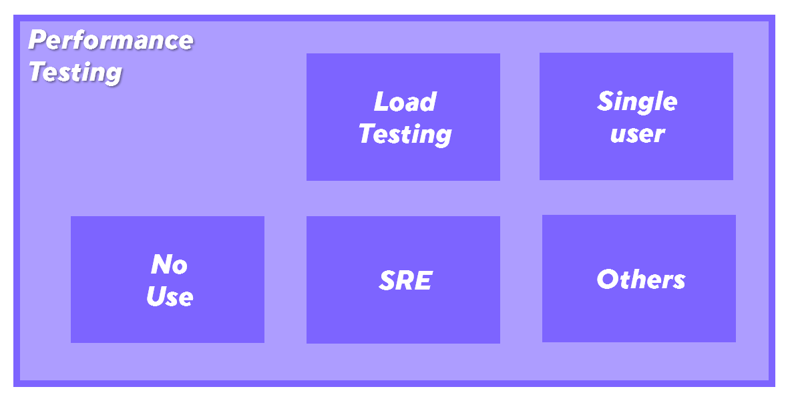

# Load Testing

## A starting note

A common mistake in the industry is to use the terms Performance Testing and Load Testing interchangeably. Load testing is a sub-practice of Performance testing.

[Performance testing](Introduction to Performance Testing) uncludes all actions that validate the speed and efficiency of software under diverse circumstances. Load testing is just one of those possible circumstances.

## Then... what is load testing?

The term "load testing" refers to a type of testing that focuses on verifying and validating software when it receives considerable volumes of work/tasks to process.

  

The term "considerable" can be very subjective and depend on the nature of the developed software. But in general, the project team has a good idea of what amounts to be considerable.

  

## Types of loads

The types of load that a system can have are related to the interaction types that the solution can have. These fall into three main types. 

1.  **Data volumes**. A system may receive large volumes of data to store or process. As well, a request may require the data volume to be submitted. These are usually large files, multiple files, multimedia, etc.
2.  **Software interactions**. Applications can interact with other applications. The application under test can send requests to other applications or receive requests from other applications. These interactions can count as "load" when they are significant in payload, response, or the number of interactions.
3.  **User interactions**. Online applications receive requests simultaneously from multiple remote users. The user interaction can be from web browsers, mobile applications, desktop applications, and many others. They also count as "load" when the payload, response, and number of requests become large.

 The most complicated kind of load test is the one that includes all of those mentioned above in the same circumstance.

  

## Reasons for load testing

Load testing assures in the same line as performance testing. Although the concern is on the impact that extensive use (load) can impact the application's performance (speed and resources.)

Slowness or unresponsiveness when any or all of the three types of described load occur is the most significant risk that load testing tries to identify.

There is a correlation between the efficiency of the application's resource usage (efficiency) and the point where the speed and responsiveness start to degrade. That is why "efficiency" is one of the performance testing practice's primary concerns. The application may not handle the expected loads if it is not efficient.

The impacts of slow, unresponsive, or unavailable applications, were described in the introduction section. - _Tip. It surrounds frustration and lost customers, but ultimately, it is about money._

  

## Ways to load test

Load testing has two main concerns. To simulate the load and measure what happens with it. The measurement focuses on the key elements: speed (response times) and efficiency (hardware impact). We will go over those techniques later in this workshop.

  

For now, we will focus on the load-simulation part. The performance testing team has two main ways to simulate different load patterns.

1.  **Manual**. Contrary to common beliefs, there are multiple ways to do load testing with real people. Manual load testing falls in the realm of Shift-Right testing techniques. We will not get in-depth about it but, beware as it is a valuable technique for performance testing in productive and pre-productive environments.
2.  **Automated.** It is the first thing most people think of performance testing. It is a programmatical computer simulation of real-user interaction with the tested system. In other words, we use programs that forge interactions to make the system think it is responding to a human request.

  

## Types of load tests

The types of load-type interactions with the developed system are varied. Generally, tests should aim at a particular situation per test. In other words, test one scenario at a time.

These scenarios refer to risky situations that the system may experience soon, typical day situations, and even low volume validations.

Some scenarios that load testing tries to test are:

-   **Common use**. This type of test usually happens in big bang releases of large applications. The application will be released soon, and the team wants to know how it will handle the load of average days.
-   **Stress**. This type applies to new releases and applications already in production. Applications at times have perfect storms. A larger-than-usual number of users may want to work with it. Even if this heavy use is improbable, Murphy's law says that teams must test those higher loads. Otherwise, the system may become slow or unavailable.
-   **Extended use**. Systems nowadays are on 24x7. They may be regularly used daily during business hours or round the clock in global solutions. Load tests must check if the system won't degrade after long periods of constant use.
-   **Sudden spikes**. Systems often are under sudden extreme loads. The rush in utilization can happen on rare occasions like annual declarations, significant shopping events, appreciated concert ticket sales, etc. These events tend to be so overwhelming that they can quickly bring down the system. Load tests should simulate these scenarios focusing on the key actions users may want to do on those events.
-   **Mini loads**. It is common to run a minimal load over a new or updated component on CI/CD projects. Here, the solution is already in production, and the team must test the new item and make sure it won't impact ongoing processes.

  

There are many other vague types of load tests. They tend to be mixes or variations of the ones mentioned above. But the best practices suggest focusing on the list above.

Previous <-- [[Introduction to Performance Testing]]

Next --> [[Performance testing methodologies]]