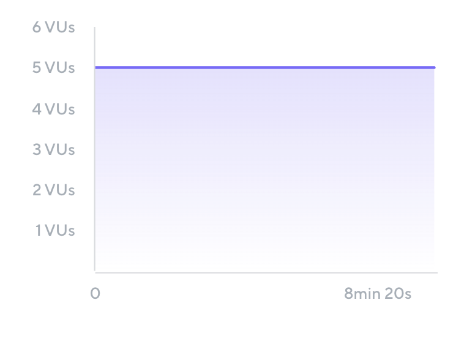
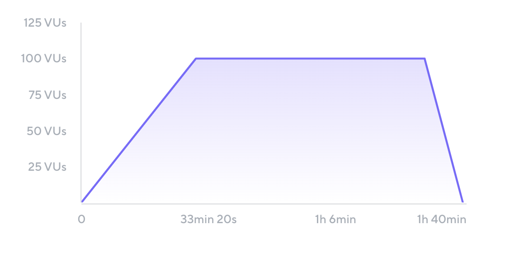
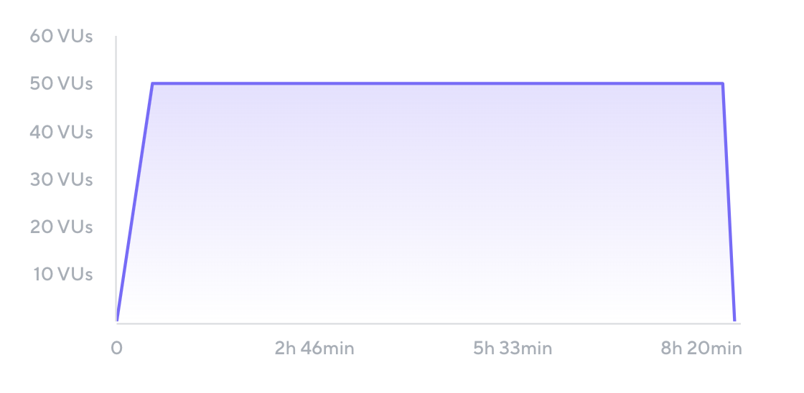
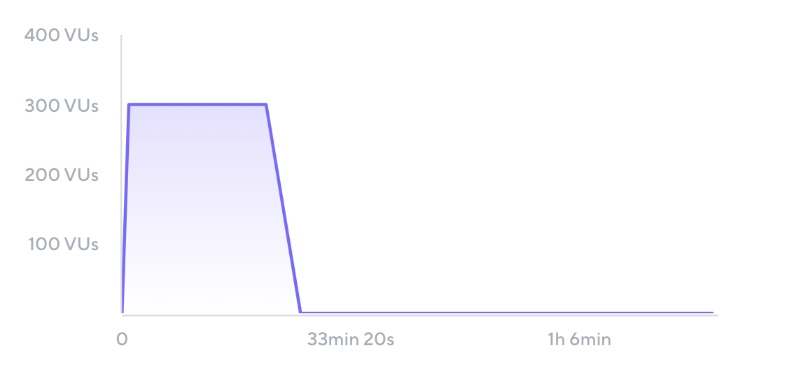
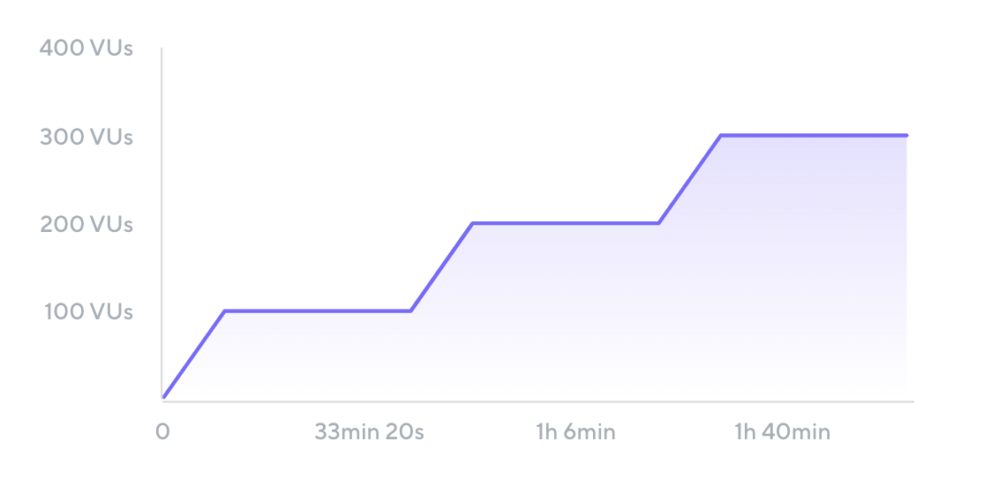

# Load Testing

A common mistake in the industry is to use the terms *performance testing* and *load testing* interchangeably. They are not interchangeable! Rather, load testing is a sub-practice of performance testing.

**Performance testing != Load testing**

[Performance testing](Introduction-to-Performance-Testing.md) verifies how well a system works as a whole, including aspects such as scalability, elasticity, availability, reliability, resiliency, and latency. Load testing is just one type of performance testing, and it is an approach that can be used to test many of aspects of application performance. However, not all performance testing involves load testing.

Load testing specifically focuses on verifying and validating the performance of an application while it has a significant volume of tasks to process. Load testing can be done manually, but most teams write automated load testing scripts to programmatically simulate real users accessing the application.

## Test parameters

When writing load-test scripts, you must consider many factors beyond the sheer amount of load to generate. These factors, called _test parameters_, include the distribution, shape, and pattern of the load.

Below is a non-exhaustive list of some common test parameters:

- **Virtual users (VUs).** A VU is an independent thread of execution that runs concurrently to other VU threads. Often, scripts will be designed in such a way that 1 VU's activity represents that of 1 real user.
- **Iterations**. The total number of iterations to be executed by the VUs.
- **Throughput**. A measure of how much load the test generates over time, usually defined in VUs per second, requests per second, or iterations per second.
- **User flows**. The actions that the script carries out, and the order they run in. In general, a user flow represents the path of a real user through the application.
- **Load profile**.The shape of the traffic generated by the test over time. It includes the number of delays (in think time), the ramp-up and ramp-down periods when the test gradually increases or decreases the amount of VUs over time, and the stages of the test.
- **Duration**. The time it takes to run the entire test and its individual stages.

## How to simulate load

In general, you can simulate load in a few ways:

**Protocol-based load testing** simulates the underlying requests going to application servers. These requests are sent over the protocol layer. Protocol-based load testing varies in scope, including both:
- targeted API testing of one or more specific application components, and
- end-to-end or more realistic testing that simulates traffic flowing through the entire system, going through multiple components

**Browser-based load testing**, on the other hand, simulates the way users interact with the application user interface. Instead of simulating protocol-level requests, browser-based testing automates things like clicks on elements of a web app, typing on a form, and other actions that real users may take. Browser-based load testing more often involves end-to-end testing.

**Hybrid load testing** is a mixture of protocol-based and browser-based testing. It's usually employed to test different aspects of performance. The most economical approach involves protocol-based load testing to generate the majority of the load in conjunction with a smaller number of browser-based load-testing users.

## Load test scenarios

A load test scenario combines specific values of test parameters. Each scenario recreates a certain situation or set of conditions that the application will be exposed to.

Load test scenarios are often called _load-tests types_. Some of the most common scenarios are listed here.

### Shakeout test

A shakeout test, sometimes known as a smoke test, is a small test that checks for major issues before spending more time and resources. A shakeout test typically uses one or a few VUs that runs for a short amount of time checks for major issues such as:
- script-related problems that would significantly impact the accuracy of test results
- unexpected environment configuration
- significant application performance bottlenecks that arise at even low loads

If a shakeout test fails, any revealed issues must first be resolved before continuing to ramp up the test throughput.

_Example:_


```
Name: Shakeout Test
Total VUs: 5	
Ramp-up: 0 seconds	
Duration: 10 minutes
Ramp-Down: 0 seconds
```


A shakeout test can also consist of [multiple scenarios](Workload-modeling-with-scenarios.md).

### Average Load Test

This scenario simulates the user workload during a typical hour in production. The scenario includes the most frequently executed requests or functionalities within that hour.

This test scenario typically includes ramp-up and ramp-down periods to simulate users gradually logging in and interacting with the system. The load test gradually increases the number of VUs until it reaches the desired load to mimic the average load behavior in production. 

Between the ramp-up and ramp-down periods is a steady state, a period when the number of virtual users is constant.
In an average load test, the test sustains the steady-state load simulation for an hour or so.

_Example_:


```	
Name: Average Load Test
Total VUs: 100	
Ramp-up: 30 minutes
Steady state: 60 minutes
Ramp-down: 10 minutes
Total duration: 100 minutes
```

In the preceding example, the average load test was defined in terms of the number of VUs, but it can also be defined in terms of the number of iterations or requests per second that the test generates. For more information, see [Setting load profiles with executors](Setting-load-profiles-with-executors.md).

### Stress test

A stress test, also known as a peak load test, simulates the traffic that the application is expected to experience at the *highest* point of the day or season. While the average load test simulates the traffic on a typical day, aggregated over a week, month, or longer, a stress test focuses on the highest amount of traffic that the application experiences.

Though a stress test is similar to an average load test in shape, it usually generates a far higher test throughput. Consider an application that typically has 100 accessing users during "normal" hours, but 300 users during the lunch hour. This application might benefit from being tested with a stress test at the 300 VU level.

Stress tests are a good test scenario when testing rush hours or sale periods during which the application faces abnormally heavy load.

### Soak or Endurance Test

Soak tests, also called endurance tests, are tests with a longer duration than average or peak tests. Some performance bottlenecks, such as ones caused by defects in memory management, appear only during longer periods of time. Soak tests verify whether performance degrades over time.

This scenario tends to have similar test throughput levels to the average load test, but it is extended to a duration of several hours or even days, depending on the application. 
  
_Example_:



```		
Name: Soak Test
Total VUs: 50
Ramp-up: 30 minutes
Steady state: 480 minutes
Ramp-down: 10 minutes
Total duration: 520 minutes (8 hours and 40 minutes)
```

### Spike Test

The previous types of tests have all recreated a situation where load is introduced gradually (such as in the case of the average, stress, and soak tests) or where a small amount of load is executed (shakeout). A spike test, on the other hand, recreates a situation where the application experiences a *sudden* and massive increase in traffic. 

Spike tests can be used to verify application performance during times when traffic goes from low to extremely high in a short amount of time. Spike tests are good for simulating timed events like:
- prominent product announcements (like in a super-bowl ad)
- product launches or sale of concert tickets
- deadlines (last days of tax submissions)
- opening of sales seasons (Black Friday or Cyber Monday)

Spike tests have high throughput and short steady-state duration. They generally have a negligible ramp-up and ramp-down period.

Another difference from the previous scenarios is the selection of user flows to be tested. Instead of a range of typical day-to-day processes, spike tests usually prioritize one user flow. 
For example, in an event ticket sale, users may focus on purchasing a ticket over browsing other pages.

_Example_:


```
Name: Spike Test	
Total VUs: 300
Ramp-up: 1 minute
Steady state: 20 minutes
Ramp-down: 5 minutes
Total duration: 26 minutes
```


### Breakpoint Test

While the previous load test types simulate realistic and expected production load, breakpoint tests attempt to go one step further. A breakpoint test exposes an application to increasing levels of load in an attempt to identify the traffic level at which performance begins to degrade.

Breakpoint tests build confidence in what a system can handle. The results from breakpoint tests provide valuable inputs for capacity planning.

A breakpoint test scenario focuses on the ramp-up period more than other scenarios. It can consist entirely of a gradual ramp-up, or it can consist of periods of ramp-ups followed by periods of steady state. The stepped load profile pattern in the following example can help correlate degraded performance with specific levels of load.

_Example_:


```
Name: Breakpoint Test	
Total max VUs: unknown
Ramp-up: 10 minutes before each stage
Steady state: 30 minutes
Ramp-down: 0 minutes
Total duration: unknown
```


Because breakpoint tests are more exploratory in nature, testers can't know in advance how many maximum VUs will be executed or how long the test will last. Teams typically monitor an application closely while a breakpoint test is running and either stop the test manually or program it to stop when it exceeds certain [thresholds](Setting-test-criteria-with-thresholds.md).

## Test your knowledge

### Question 1

Which of the following statements about performance best practices is true?

A: The load test scenario selected can significantly impact the accuracy of test results. 

B: The best way to do performance testing is to simulate the peak load of users that would access the application in production.

C: The number of virtual users in a test is the most important test parameter in a scenario.

### Question 2

Which of the following test scenarios should you use for your first test execution on a new application and environment?

A: Soak Test

B: Shakeout Test

C: Regression Test

### Question 3

Which of the following test scenarios would be best suited for testing a memory leak?

A: Stress Test

B: Soak Test

C: Average Load Test

### Answers

1. A. B describes one type of load test, peak load tests, and C mentions only one of many test parameters that could have an impact on the test scenario chosen and the test results.
2. B. A soak test is executed over a longer period of time, and can end in too many errors to be useful if the environment has not yet gone through shakeout testing. Full regression tests could likewise not be too useful without first verifying that the environment and script(s) work.
3. B. While memory leaks can be discovered during stress and average load tests, the longer duration of soak tests makes them uniquely suited for unearthing more gradual trends like memory leaks.
