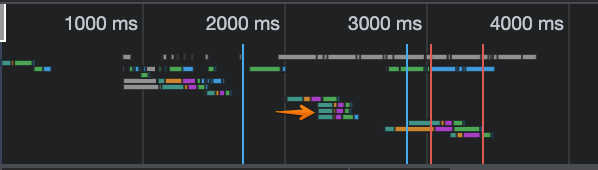

# Parallel requests in k6
Parallel requests are requests that are sent at the same time. Parallel requests are sometimes called "concurrent" requests.

This screenshot shows the Network panel in Chrome DevTools while a site is loaded. Each bar shows when resources embedded in the page were requested throughout the first 4000 ms.



The orange arrow points to three parallel requests. This indicates that the client (in this case, the browser) sent three different HTTP requests at the same time.

Parallel requests influence load testing results because it increases test throughput. Increased test throughput affects load testing in two ways:
- First, sending requests in parallel takes less time than sending them sequentially, so the load generator may experience higher resource utilization over a shorted amount of time.
- Second, parallel requests also get to the application server faster, which could increase resource utilization on the server side as well.

If parallel requests potentially increase utilization on the load generator running the script _and_ the application server, why would we use them?

## When should you use parallel requests?

Parallel requests should be used when they are also used in production. In these situations, parallel requests make a test more realistic. Modern browsers have a degree of parallelism by default, so a load test for a website or web app should typically account for parallel requests.

In contrast, API calls may _not_ typically be triggered simultaneously, so it may be more realistic to send requests sequentially.

When in doubt about whether you should use parallel requests, use your browser's DevTools or a proxy sniffer while you access your application to see how requests are sent in production.

## Batching in k6

By default, each k6 user sends each request in the script sequentially. To change this behavior, you can use batching.

Batching signals to k6 that the requests within a batch must be sent simultaneously, and you can use it like this:

```js
import { check } from 'k6';
import http from 'k6/http';

const domain = 'https://test.k6.io';

export default function () {
    let responses = http.batch([
        ['GET', domain + '/'],
        ['GET', domain + '/static/css/site.css'],
        ['GET', domain + '/static/js/prisms.js'],
        ['GET', domain + '/static.favicon.ico'],
        ['GET', domain + '/static/img/logo.png'],
    ])
  check(responses[0], {
    'Homepage successfully loaded': (r) => r.body.includes("Collection of simple web-pages suitable for load testing"),
  });
}
```

The script above sends five requests in parallel, all of which are embedded into the homepage. Each of the responses is saved as an array in the variable `responses`, and the check verifies that the very first element of that array, `responses[0]`, the homepage, contains text that proves that the script successfully retrieved the HTML body.

You can batch requests even if they are not all HTTP GET requests. For example, you could use HTTP GET and HTTP POST requests in the same batch. You can find [more information here](https://k6.io/docs/javascript-api/k6-http/batch-requests/).

## Test your knowledge

### Question 1

Which of the following statements is true?

A: Whether or not to use parallel requests depends on your test scenario.
B: Using parallel requests is always recommended as a performance testing best practice.
C: Parallel requests should always be used for testing websites.

### Question 2

Which of the following might be a side effect of you including parallel requests in your script?

A: Your load generator sends fewer requests when some are batched.
B: Your load test's executed requests per second (rps) will increase.
C: The application server caches batched requests and performance is improved.

### Question 3

When might you _not_ want to use parallel requests?

A: When you want to increase the amount of requests your test is sending
B: When you have requests using multiple types of HTTP methods
C: When you're testing API endpoints

### Answers

1. A. Parallel requests are sometimes, but not always, useful. For example, they are useful if you're trying to simulate a user accessing a web app on a browser, but not so useful if you're trying to mimic sequential requests to an API endpoint.
2. B. All other things being equal, increasing the parallelism of your requests will increase the throughput (rps) of your test.
3. A. The key here is your objective, not *what* you're testing. If you want to increase your test throughput (the amount of requests sent by k6), parallel requests *would* be a valid way to do that. Whether you're using multiple HTTP methods or testing API endpoints is beside the point.
