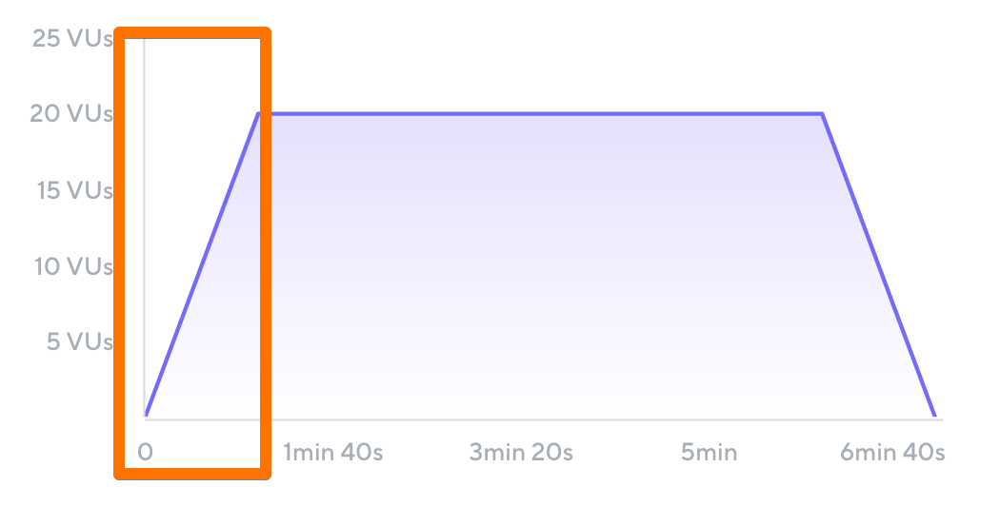
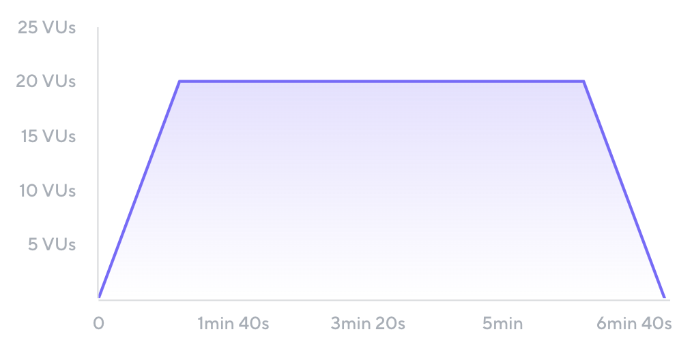

A test parameter describes the situation under which traffic is generated during the load test. Below are some common test parameters:

- Transaction distribution
- Ramp-up and ramp-down
- Steady state
- Duration
- Concurrency
- Throughput
- Load profile

We'll discuss each one in more detail below.

## Transaction distribution

A [transaction](Performance%20Testing%20Terminology.md#Transaction) is a grouping of requests or steps that are triggered by a single user action. For example, a login transaction might consist of the following steps:
- Type in username
- Type in password
- Click LOG IN button.

The same transaction might consist of the following underlying requests:
- HTTP POST to the authentication server with the login credentials
- A redirect to the authenticated user's account page
- HTTP GET for the HTML and embedded resources for the user's account page

In load testing, transactions are used to organize scripts in a user-oriented way, where one transaction corresponds to one user action.

A load test typically consists of multiple transactions, depending on the situation that you want to simulate. During test execution, you can set how often each transaction is executed, usually using the number of transactions per second or percentages. For example, consider a theoretical transaction distribution for an ecommerce site:

- Home page: 100%
	- View Product List: 50%
		- View Product Page: 25%
			- Add to Cart: 15%
				- Checkout: 10%
	- Contact Us Page: 3%
	- (exit) 47%

In this example, all of the users accessing a site go to the home page, but only 10% of them end up purchasing a product. Each line above (except for the 47% that exited the application after viewing the home page) is a transaction.

The transaction distribution for a load test describes:
- which transactions are included in the test
- how often the included transactions are executed
                     
## Ramp-up and ramp-down periods

Ramp-up is the amount of time it takes for a load test to go from 0 users to the desired number of users, and is found at the beginning of a test. Ramp-down is the time it takes for a load test to go from the desired number of users back down to 0, and is found at the end of a test. Ramp-up and ramp-down periods simulate real traffic against an application. In many production environments, users do not start accessing a site simultaneously, and instead gradually trickle into the application, and away from it, over some time.


_Load test with ramp-up period highlighted_

In the load test above, the highlighted portions show the ramp-up period, which is 5 minutes. During the first 5 minutes of the test, the script gradually increases the number of virtual users from 0 to 20.

The same test also has a ramp-down period, but it is significantly shorter, at 1 minute. Ramp-up periods and ramp-down periods do not have to be the same length, and it is valid to have one, none, or both.

```ad-tip
Ramp-up and ramp-down periods are best used for applications that do not have a hard start or hard end to production traffic. In some situations, such as when simulating traffic for a sale that begins at a specific time, it may be more realistic to remove ramp-up and/or ramp-down periods.
```

## Steady state

The steady state is any period of time during the load test where the number of virtual users is constant. The steady state does not include ramp-up or ramp-down periods. The unchanging load during a steady state makes it an ideal time period for analyzing how well an application responds to the conditions created by a load test.


_Steady state during a load test_

## Duration

The duration of a load test is how long it takes to complete, from beginning to end. It includes the ramp-up, ramp-down, and steady state portions of a load test.

## Concurrency

User concurrency is the number of users that are accessing an application at a given point in time. In load tests, this is measured in terms of the total virtual users.

## Throughput

Throughput is a general term for the

## Load profile

A load profile describes the shape of the traffic generated over a certain amount of time. The load profile you decide on for your test is determined by the scenario you're trying to recreate.

Load profiles are typically described by plotting the number of virtual users over time.



_Constant load profile_

The most common load profile is 

## Test your knowledge

### Question 1