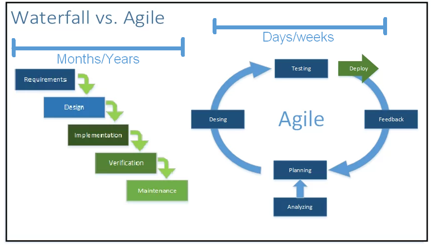
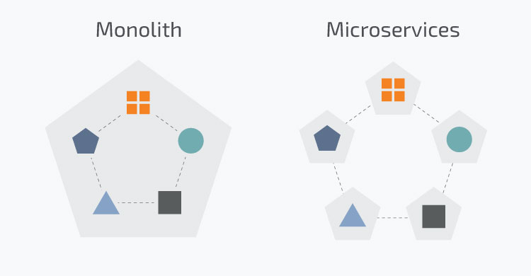

# Performance testing Methodologies
Software development methodologies. The software world has been changing a lot recently, not only in technological terms but also in how we create it. Both changes impact software's multiple areas, especially how we test it and assure its quality. As performance testing is a proud member of the QA realm, of course, it gets several impacts and changes to its ways.

On top of it, new technologies are changing how we do things. Some of those new techs are service tiered applications, micro-services spread all over the place, and even the cloud! All are changing how we do things.

But before we get deeper into those impacts on the performance ways, let's do a quick recap on what are these software development methodologies.

## Methodologies in general

Today, right after the pandemic days, we have two primary methodologies used in the software industry. Each of the two types has variations, but we can group them into two big flavors: Waterfall and Agile.

Waterfall seems to be on its way out. Most organizations are trying to transition away from Waterfall and embrace a variation of the new Agile methodologies. Some are taking steps, others are struggling, and very few are successfully implementing and reaping their success.

Here is a short description of each type.

  

### Waterfall methodologies

The waterfall methodologies have been present in the software development industry almost from its beginnings. A brief description would be a phased project. Each phase involved specific groups of specialized people, and generally, the final product was delivered several months and even years after it started.

  

An average waterfall project would start with a **discovery** phase defining problems and needs around making it happen. Then, a **design** phase would plan every second of the project's long life. The team would begin the **build-up** phase that constructed everything on the plan at hand. The **testing** phase would start once all the code was written and assembled. Finally, after the software (hopefully) passes all the tests, it is ready for **release**. Once finished, the implementing team would **wrap up** and set off to new pastures.

  

Some of the flaws in the waterfall methodologies are: 

Most of the time, the projections and estimations were wrong with so much time in advance. Issues impacted the schedule, but management rarely changed the release date or scope. Other sliding phases commonly ate the time allowed for testing. It was hard to go back to the development phase when testing found issues. As the release date came closer, the teams churned to deliver still on time. And many more.

  

### Agile methodologies

There are so many variations for these development styles. Among them, we can find Scrum, CI/CD, DevOps, Kanban, Shape-Up, SAFE, and the list goes on and on. 

But an essential characteristic for all these methodologies is splitting the deliverable into small pieces. Then, releasing those pieces as often as possible. Contrary to the Waterfall, which had a single big-bang release once or twice a year.

The goal is to get those pieces in front of the end-user as fast as possible, measure the reception and quality, and define the following steps based on that feedback.

  

**_Note_**: If you find a project that claims to be an Agile flavor but doesn't release to _production_ frequently nor pay close attention to those frequent releases' feedback, they may not be agile.

  

## Tech landscape

In addition to those crazy changes in how we do projects, the software development technologies will impact how we test them. 

Here we also have two principal classifications on the way software is done. They are called multiple names, but we will name them the **Monolith** and **Modern** tech for this explanation.

  

### The Monolith

We refer to most old software solutions as monolithic. In some ways, this officially means that a solution sits in a single box, environment, realm, or packed up together. No service tier (or very weak), front-end and back-end requests are usually in the same call, no distribution, any change/problem will stop the whole thing, it is tough to segment test steps, and the list goes on.

  

### Modern apps

These applications have implemented multiple new technologies or ways to do software. To start, they are considerably modular and distributed. They separate the front-end tier from the back-end processing tier through services, making it easier to update continuously and somewhat isolated. Those services may be micro, distributed, separated, in the cloud, or provided by third parties. The modularity and distribution provide a crazy amount of possibilities!

  

**_Note_**: There are hybrid solutions. Some organizations try to migrate gradually without dumping old systems at once. The approach to performance testing will be complex in those cases. 

## Performance testing

In the same way, QA practices, and especially performance testing, are different depending on the methodology and technology that the application has.

Let's dive into how is the approach on each of those methodologies. But beware, there is a mix on the path. We have the two methodologies mentioned above, but our solutions also have two other variations: ancient designs and modern technology. These are the monoliths on the one hand, and on the other, the contemporary service-tiered cloud apps.

We will go over each of those variations with a brief description of how we should do each project mix.

  

### Waterfall + Monolith

In the past, this was the traditional mix. Most of the projects were performance testing this way ten years ago.

It is heavily phased in the same way as Waterfall does. On top of that, since it is monolithic, it focuses on automating front-end and end-to-end load tests. The big-bang release nature of Waterfall and the Monolithic solutions make it almost mandatory to focus on load testing for production and worst-case scenario loads.

The performance (load) testing project will have the following phases that usually start after development has finished: **Discovery**, figuring out the performance risks, the system uses, and processes available. **Design**, identify the business processes to script, document load test cases, plan every script, every scenario run, and document it all. **Creation**, script all the business processes, create the scenarios, getting everything ready to run some load tests. **Execution**, run all the planned load scenarios, gather the results from each, report any found issues, and repeat if needed/viable. **Reporting**, right before the production release, present the findings; this may stop the production release if the results need rework.

There are several drawbacks to this approach, like the impact on the release date or scope if any issue appears. But given the siloed design of Waterfall, the need for load assurance before big-bang releases, and the Monolithic design, there may be no other way for this type of project without redesigning the whole approach.

  

### Waterfall + Modern

Some projects and applications may be embracing modern technologies, but they are still following the Waterfall model. 

  

### Agile + Monolith

Nope. Just nope, and again nope. Sadly many organizations are trying to implement agile methodologies while keeping a monolith.

  

### Agile + Modern