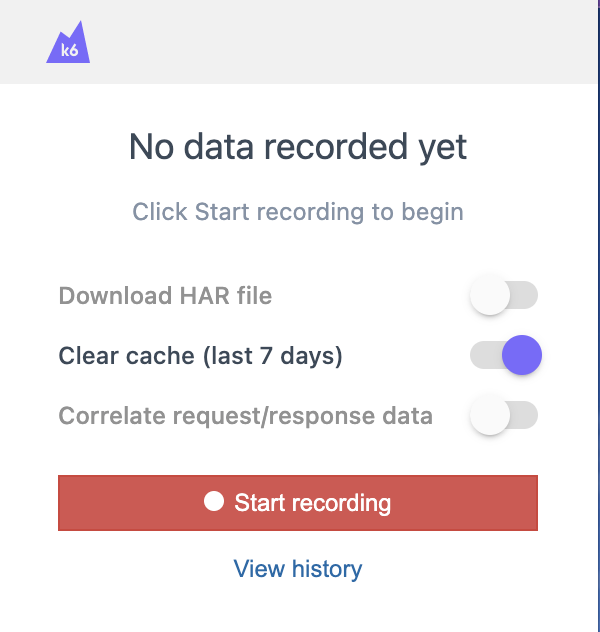
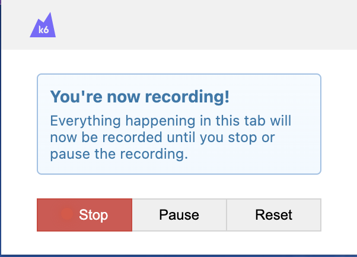
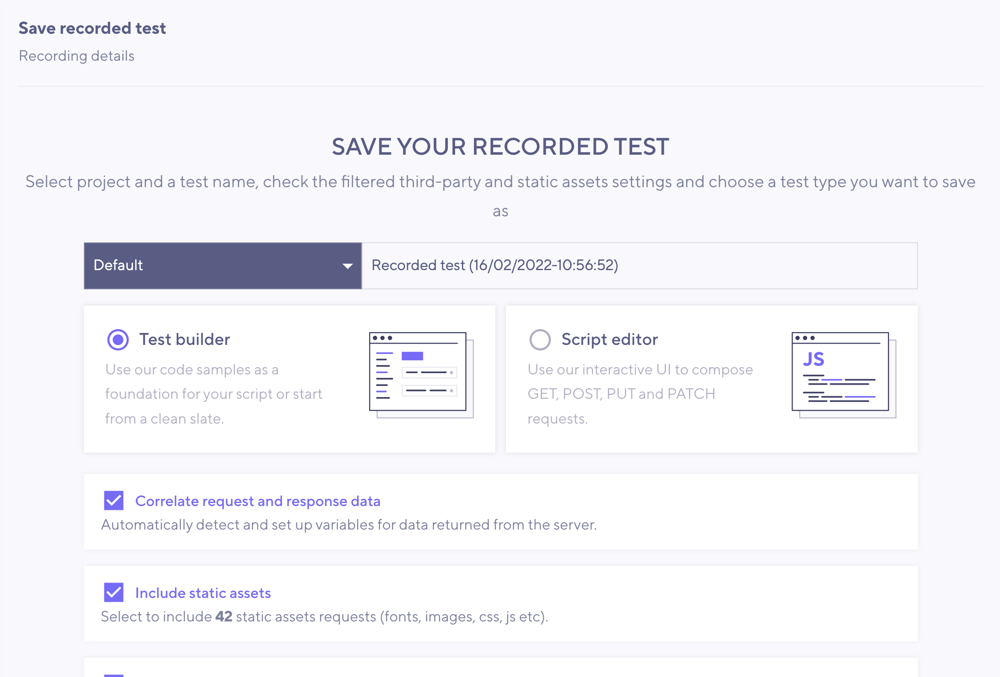
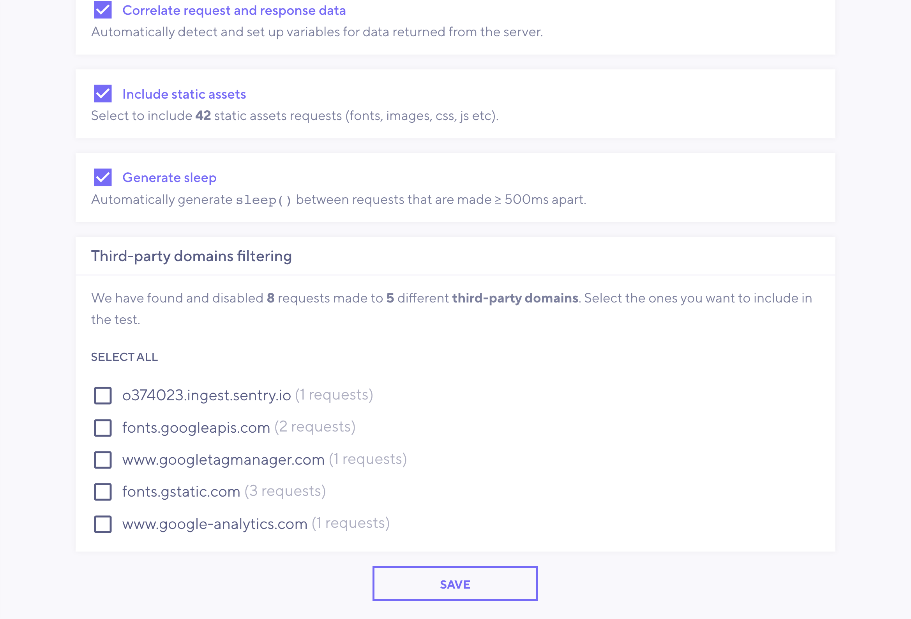
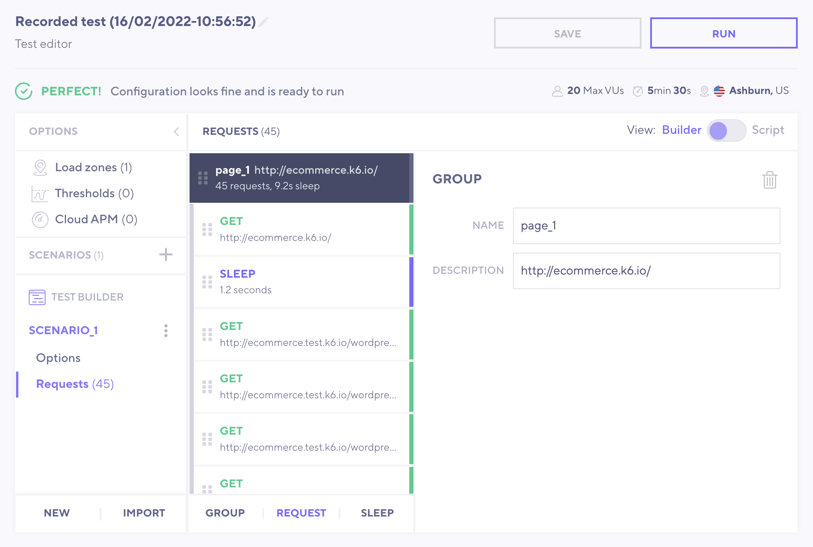
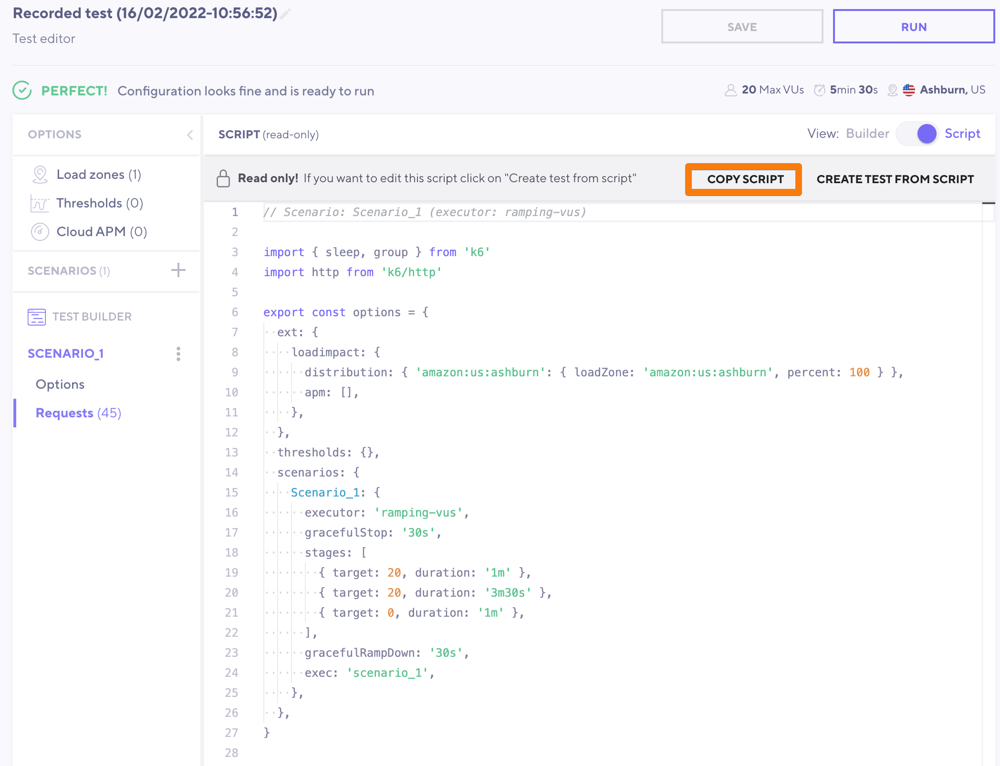
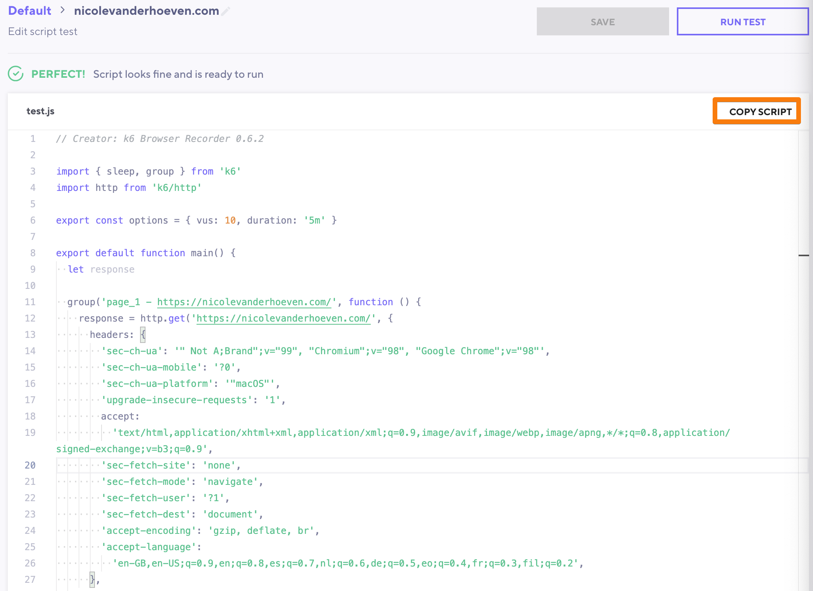

You've already learned how to [write your first k6 script](Getting%20started%20with%20k6%20OSS.md). Why would you want to _record_ one?

Writing a k6 script yourself is the best way to learn how k6 works, and the skills that you've learned in previous sections will make you a better tester because even recorded scripts will need to be modified. Writing a k6 script may still be the better option in these situations:
- You want your script to make a series of API calls.
- Your test targets a specific component or group of components, rather than generating load from the client side.
- The API endpoints you want to test are well-documented, or you already have prior knowledge about them.
- The flow you're simulating cannot be easily simulated from a browser.

However, there are also situations where recording a script may save time:
- You are testing a web page and want to include requests for embedded resources on a page (scripts and images), rather than just the HTML.
- The application involves a lot of [dynamic correlation](Dynamic%20correlation%20in%20k6.md), and you want most of that work done for you.
- You aren't sure what the underlying HTTP requests are, or the API isn't well-documented.

In this section, you'll learn how to record a k6 script.
## Creating a k6 Cloud account

Did you know that you can use k6 Cloud's script recording features for free?

Recording a k6 script requires a k6 Cloud account, but it doesn't have to be a paid one, and you don't need to enter credit card details. To get started, [sign up for an account](https://app.k6.io/). Make sure you're signed in before you proceed.

Next, download and install the k6 browser recording extension for your browser-- [Chrome](https://chrome.google.com/webstore/detail/k6-browser-recorder/phjdhndljphphehjpgbmpocddnnmdbda?hl=en) and [Firefox](https://addons.mozilla.org/en-US/firefox/addon/k6-browser-recorder/) are supported. When you see the k6 icon on your extension bar, you're ready to start recording.


Then, open up a new tab and click on the k6 browser extension icon. You'll see a dialog box with some initial options:


Here's what those options mean:
- **Download HAR file**: HAR stands for HTTP ARchive, which is a JSON-formatted file that is used to save network information like HTTP requests and timings. Enable this if you'd like to be able to be able to save the recording somewhere other than k6. Otherwise, **leave this disabled**.
- **Clear cache (last 7 days):** Enabling this deletes your browser cache for the last week. This is useful if what you want to simulate a new user to your application. Disable this if you want to simulate an existing user. Otherwise, **leave this option enabled**. (Read more about [caching options here](Caching%20options.md).)
- **Correlate request/response data:** The k6 recorder can automatically detect when dynamic values are being passed to the application servers and try to correlate them for you. This doesn't always work for complex applications, but it can be a good starting point for scripting. **Enable this option** unless you'd prefer to have a raw recording.

Next, click the _Start recording_ button. It may take a few seconds for your last week's browser cache to be deleted. Wait until you see the following screen:




Now you're ready to start recording! Navigate to your web application, and interact with it the way one of your users would.

### Tips for recording

To make the best out of your recording, keep the following tips in mind:
- If you'd like to get an idea of how long the [sleep](Adding%20think%20time%20using%20sleep.md) should be, try filling out forms and reading text the way a new user would. Sleep timings are recorded by the extension.
- Wait for all the page's resources to load before you proceed to the next page or action. If you'd like to be sure, try opening up DevTools for your browser and waiting until there is no activity in the Network tab.
- Take notes separately about the actions you're doing, to help you make sense of the generated script later.
- Record one business flow at a time. If you record multiple long or complex flows, your script may get too large and unwieldy. It's easier to combine multiple scripts than it is to split them apart later.

## Saving the recorded script to k6 Cloud

When you're done, click _Stop_ on the browser recorder. You will be automatically redirected to your k6 Cloud account:





Let's go over the options!

- **Project:** In this dropdown menu, you can select which k6 Cloud project you'd like to save this recording to. If you haven't created any projects yet, you'll see the _Default_ project selected.
- **Title:** Next to the project selection dropdown, give your recording a descriptive name that will help you remember what this recording was later.
- **Test Builder or Script Editor:** Decide whether you'd like to see your recorded flow in the Test Builder (GUI) or the Script Editor (plain JavaScript). You'll learn more about these options later. For now, choose Test Builder if you'd be more comfortable interacting with an interface, and the Script Editor if you'd prefer to see the code. If you're not sure, choose Test Builder and you'll be able to switch to the Script Editor later if you change your mind.
- **Correlate request and response data:** Tick this option if you'd like k6 to detect and correlate dynamic data for you.
- **Include static assets:** Tick this option if you'd like your test script to include requests for embedded resources like scripts, fonts, and images. Ticking this option makes the script more [realistic](Workload%20modeling.md), but at the cost of more requests.
- **Generate sleep**: Tick this option if you'd like k6 to [add think time](Adding%20think%20time%20using%20sleep.md) based on your actual delays while recording.
- **Third-party domains filtering:** By default, k6 ignores requests sent to domains other than the one you initially navigated to. Doing so prevents you from accidentally load testing servers that don't belong to you. Have a look at the domains listed, and tick any that you'd like to include in the test. _Note: Testing servers you don't own could lead to legal or financial ramifications, so we recommend you test only servers you own._

Then, click Save!

### Test Builder

If you chose the Test Builder option in the previous step, you'll see a screen like this:



From here, you can continue to explore, build out your script, and ramp it up to run as a shakeout or load test. You can find out more information about [using the Test Builder here](Creating%20a%20script%20using%20the%20Test%20Builder.md). However, keep in mind that running the test on k6 Cloud will use up one of your free test runs. If you'd like to run the test locally, click on the toggle to switch from _Builder_ to _Script_.

### Script Editor

If you switched to the Script Editor from Test Builder, your script will be displayed in _read only_ mode:



Click _COPY SCRIPT_, as highlighted in orange in the screenshot, to select and copy the entire script. You can then paste the script into your IDE and [run your script locally](Getting%20started%20with%20k6%20OSS.md#Hello%20World%20running%20your%20k6%20script).

If, instead, you chose the _Script Editor_ option in the recording dialog screen earlier, you'll see your test script displayed in k6 Cloud in an editable mode. 



You can modify the script here, or click the _COPY SCRIPT_ button to select all the text in your script. You can then paste the script into your IDE of choice and continue working on it there.

%%
```js
// Scenario: Scenario_1 (executor: ramping-vus)

import { sleep, group } from 'k6'
import http from 'k6/http'

export const options = {
  ext: {
    loadimpact: {
      distribution: { 'amazon:us:ashburn': { loadZone: 'amazon:us:ashburn', percent: 100 } },
      apm: [],
    },
  },
  thresholds: {},
  scenarios: {
    Scenario_1: {
      executor: 'ramping-vus',
      gracefulStop: '30s',
      stages: [
        { target: 20, duration: '1m' },
        { target: 20, duration: '3m30s' },
        { target: 0, duration: '1m' },
      ],
      gracefulRampDown: '30s',
      exec: 'scenario_1',
    },
  },
}

export function scenario_1() {
  let response

  group('page_1 - http://ecommerce.k6.io/', function () {
    response = http.get('http://ecommerce.k6.io/', {
      headers: {
        'upgrade-insecure-requests': '1',
        accept:
          'text/html,application/xhtml+xml,application/xml;q=0.9,image/avif,image/webp,image/apng,*/*;q=0.8,application/signed-exchange;v=b3;q=0.9',
        'accept-encoding': 'gzip, deflate',
        'accept-language':
          'en-GB,en-US;q=0.9,en;q=0.8,es;q=0.7,nl;q=0.6,de;q=0.5,eo;q=0.4,fr;q=0.3,fil;q=0.2',
      },
    })
    sleep(1.2)

    response = http.get(
      'http://ecommerce.test.k6.io/wordpress/wp-includes/css/dist/block-library/style.min.css?ver=5.9',
      {
        headers: {
          accept: 'text/css,*/*;q=0.1',
          'accept-encoding': 'gzip, deflate',
          'accept-language':
            'en-GB,en-US;q=0.9,en;q=0.8,es;q=0.7,nl;q=0.6,de;q=0.5,eo;q=0.4,fr;q=0.3,fil;q=0.2',
        },
      }
    )

    response = http.get(
      'http://ecommerce.test.k6.io/wordpress/wp-content/plugins/woocommerce/packages/woocommerce-blocks/build/vendors-style.css?ver=4.0.0',
      {
        headers: {
          accept: 'text/css,*/*;q=0.1',
          'accept-encoding': 'gzip, deflate',
          'accept-language':
            'en-GB,en-US;q=0.9,en;q=0.8,es;q=0.7,nl;q=0.6,de;q=0.5,eo;q=0.4,fr;q=0.3,fil;q=0.2',
        },
      }
    )

    response = http.get(
      'http://ecommerce.test.k6.io/wordpress/wp-content/plugins/woocommerce/packages/woocommerce-blocks/build/style.css?ver=4.0.0',
      {
        headers: {
          accept: 'text/css,*/*;q=0.1',
          'accept-encoding': 'gzip, deflate',
          'accept-language':
            'en-GB,en-US;q=0.9,en;q=0.8,es;q=0.7,nl;q=0.6,de;q=0.5,eo;q=0.4,fr;q=0.3,fil;q=0.2',
        },
      }
    )

    response = http.get(
      'http://ecommerce.test.k6.io/wordpress/wp-content/themes/storefront/assets/css/base/gutenberg-blocks.css?ver=3.5.0',
      {
        headers: {
          accept: 'text/css,*/*;q=0.1',
          'accept-encoding': 'gzip, deflate',
          'accept-language':
            'en-GB,en-US;q=0.9,en;q=0.8,es;q=0.7,nl;q=0.6,de;q=0.5,eo;q=0.4,fr;q=0.3,fil;q=0.2',
        },
      }
    )

    response = http.get(
      'http://ecommerce.test.k6.io/wordpress/wp-content/themes/storefront/style.css?ver=3.5.0',
      {
        headers: {
          accept: 'text/css,*/*;q=0.1',
          'accept-encoding': 'gzip, deflate',
          'accept-language':
            'en-GB,en-US;q=0.9,en;q=0.8,es;q=0.7,nl;q=0.6,de;q=0.5,eo;q=0.4,fr;q=0.3,fil;q=0.2',
        },
      }
    )

    response = http.get(
      'http://ecommerce.test.k6.io/wordpress/wp-content/themes/storefront/assets/css/base/icons.css?ver=3.5.0',
      {
        headers: {
          accept: 'text/css,*/*;q=0.1',
          'accept-encoding': 'gzip, deflate',
          'accept-language':
            'en-GB,en-US;q=0.9,en;q=0.8,es;q=0.7,nl;q=0.6,de;q=0.5,eo;q=0.4,fr;q=0.3,fil;q=0.2',
        },
      }
    )

    response = http.get(
      'http://ecommerce.test.k6.io/wordpress/wp-content/themes/storefront/assets/css/woocommerce/woocommerce.css?ver=3.5.0',
      {
        headers: {
          accept: 'text/css,*/*;q=0.1',
          'accept-encoding': 'gzip, deflate',
          'accept-language':
            'en-GB,en-US;q=0.9,en;q=0.8,es;q=0.7,nl;q=0.6,de;q=0.5,eo;q=0.4,fr;q=0.3,fil;q=0.2',
        },
      }
    )

    response = http.get(
      'http://ecommerce.test.k6.io/wordpress/wp-includes/js/jquery/jquery.min.js?ver=3.6.0',
      {
        headers: {
          accept: '*/*',
          'accept-encoding': 'gzip, deflate',
          'accept-language':
            'en-GB,en-US;q=0.9,en;q=0.8,es;q=0.7,nl;q=0.6,de;q=0.5,eo;q=0.4,fr;q=0.3,fil;q=0.2',
        },
      }
    )

    response = http.get(
      'http://ecommerce.test.k6.io/wordpress/wp-includes/js/jquery/jquery-migrate.min.js?ver=3.3.2',
      {
        headers: {
          accept: '*/*',
          'accept-encoding': 'gzip, deflate',
          'accept-language':
            'en-GB,en-US;q=0.9,en;q=0.8,es;q=0.7,nl;q=0.6,de;q=0.5,eo;q=0.4,fr;q=0.3,fil;q=0.2',
        },
      }
    )
    sleep(0.7)

    response = http.get(
      'http://ecommerce.test.k6.io/wordpress/wp-content/plugins/woocommerce/assets/js/jquery-blockui/jquery.blockUI.min.js?ver=2.70',
      {
        headers: {
          accept: '*/*',
          'accept-encoding': 'gzip, deflate',
          'accept-language':
            'en-GB,en-US;q=0.9,en;q=0.8,es;q=0.7,nl;q=0.6,de;q=0.5,eo;q=0.4,fr;q=0.3,fil;q=0.2',
        },
      }
    )

    response = http.get(
      'http://ecommerce.test.k6.io/wordpress/wp-content/plugins/woocommerce/assets/js/frontend/add-to-cart.min.js?ver=5.0.1',
      {
        headers: {
          accept: '*/*',
          'accept-encoding': 'gzip, deflate',
          'accept-language':
            'en-GB,en-US;q=0.9,en;q=0.8,es;q=0.7,nl;q=0.6,de;q=0.5,eo;q=0.4,fr;q=0.3,fil;q=0.2',
        },
      }
    )

    response = http.get(
      'http://ecommerce.test.k6.io/wordpress/wp-content/plugins/woocommerce/assets/js/js-cookie/js.cookie.min.js?ver=2.1.4',
      {
        headers: {
          accept: '*/*',
          'accept-encoding': 'gzip, deflate',
          'accept-language':
            'en-GB,en-US;q=0.9,en;q=0.8,es;q=0.7,nl;q=0.6,de;q=0.5,eo;q=0.4,fr;q=0.3,fil;q=0.2',
        },
      }
    )

    response = http.get(
      'http://ecommerce.test.k6.io/wordpress/wp-content/plugins/woocommerce/assets/js/frontend/woocommerce.min.js?ver=5.0.1',
      {
        headers: {
          accept: '*/*',
          'accept-encoding': 'gzip, deflate',
          'accept-language':
            'en-GB,en-US;q=0.9,en;q=0.8,es;q=0.7,nl;q=0.6,de;q=0.5,eo;q=0.4,fr;q=0.3,fil;q=0.2',
        },
      }
    )

    response = http.get(
      'http://ecommerce.test.k6.io/wordpress/wp-content/plugins/woocommerce/assets/js/frontend/cart-fragments.min.js?ver=5.0.1',
      {
        headers: {
          accept: '*/*',
          'accept-encoding': 'gzip, deflate',
          'accept-language':
            'en-GB,en-US;q=0.9,en;q=0.8,es;q=0.7,nl;q=0.6,de;q=0.5,eo;q=0.4,fr;q=0.3,fil;q=0.2',
        },
      }
    )

    response = http.get(
      'http://ecommerce.test.k6.io/wordpress/wp-content/themes/storefront/assets/js/navigation.min.js?ver=3.5.0',
      {
        headers: {
          accept: '*/*',
          'accept-encoding': 'gzip, deflate',
          'accept-language':
            'en-GB,en-US;q=0.9,en;q=0.8,es;q=0.7,nl;q=0.6,de;q=0.5,eo;q=0.4,fr;q=0.3,fil;q=0.2',
        },
      }
    )

    response = http.get(
      'http://ecommerce.test.k6.io/wordpress/wp-content/themes/storefront/assets/js/skip-link-focus-fix.min.js?ver=20130115',
      {
        headers: {
          accept: '*/*',
          'accept-encoding': 'gzip, deflate',
          'accept-language':
            'en-GB,en-US;q=0.9,en;q=0.8,es;q=0.7,nl;q=0.6,de;q=0.5,eo;q=0.4,fr;q=0.3,fil;q=0.2',
        },
      }
    )

    response = http.get(
      'http://ecommerce.test.k6.io/wordpress/wp-content/themes/storefront/assets/js/vendor/pep.min.js?ver=0.4.3',
      {
        headers: {
          accept: '*/*',
          'accept-encoding': 'gzip, deflate',
          'accept-language':
            'en-GB,en-US;q=0.9,en;q=0.8,es;q=0.7,nl;q=0.6,de;q=0.5,eo;q=0.4,fr;q=0.3,fil;q=0.2',
        },
      }
    )

    response = http.get(
      'http://ecommerce.test.k6.io/wordpress/wp-content/themes/storefront/assets/js/woocommerce/header-cart.min.js?ver=3.5.0',
      {
        headers: {
          accept: '*/*',
          'accept-encoding': 'gzip, deflate',
          'accept-language':
            'en-GB,en-US;q=0.9,en;q=0.8,es;q=0.7,nl;q=0.6,de;q=0.5,eo;q=0.4,fr;q=0.3,fil;q=0.2',
        },
      }
    )

    response = http.get(
      'http://ecommerce.test.k6.io/wordpress/wp-content/themes/storefront/assets/js/footer.min.js?ver=3.5.0',
      {
        headers: {
          accept: '*/*',
          'accept-encoding': 'gzip, deflate',
          'accept-language':
            'en-GB,en-US;q=0.9,en;q=0.8,es;q=0.7,nl;q=0.6,de;q=0.5,eo;q=0.4,fr;q=0.3,fil;q=0.2',
        },
      }
    )

    response = http.get(
      'http://ecommerce.test.k6.io/wordpress/wp-includes/js/wp-emoji-release.min.js?ver=5.9',
      {
        headers: {
          accept: '*/*',
          'accept-encoding': 'gzip, deflate',
          'accept-language':
            'en-GB,en-US;q=0.9,en;q=0.8,es;q=0.7,nl;q=0.6,de;q=0.5,eo;q=0.4,fr;q=0.3,fil;q=0.2',
        },
      }
    )

    response = http.get(
      'http://ecommerce.test.k6.io/wordpress/wp-content/uploads/2021/02/K6-logo.png',
      {
        headers: {
          accept: 'image/avif,image/webp,image/apng,image/svg+xml,image/*,*/*;q=0.8',
          'accept-encoding': 'gzip, deflate',
          'accept-language':
            'en-GB,en-US;q=0.9,en;q=0.8,es;q=0.7,nl;q=0.6,de;q=0.5,eo;q=0.4,fr;q=0.3,fil;q=0.2',
        },
      }
    )

    response = http.get(
      'http://ecommerce.test.k6.io/wordpress/wp-content/uploads/2021/02/album-1.jpg',
      {
        headers: {
          accept: 'image/avif,image/webp,image/apng,image/svg+xml,image/*,*/*;q=0.8',
          'accept-encoding': 'gzip, deflate',
          'accept-language':
            'en-GB,en-US;q=0.9,en;q=0.8,es;q=0.7,nl;q=0.6,de;q=0.5,eo;q=0.4,fr;q=0.3,fil;q=0.2',
        },
      }
    )

    response = http.get(
      'http://ecommerce.test.k6.io/wordpress/wp-content/uploads/2021/02/beanie-2.jpg',
      {
        headers: {
          accept: 'image/avif,image/webp,image/apng,image/svg+xml,image/*,*/*;q=0.8',
          'accept-encoding': 'gzip, deflate',
          'accept-language':
            'en-GB,en-US;q=0.9,en;q=0.8,es;q=0.7,nl;q=0.6,de;q=0.5,eo;q=0.4,fr;q=0.3,fil;q=0.2',
        },
      }
    )

    response = http.get(
      'http://ecommerce.test.k6.io/wordpress/wp-content/uploads/2021/02/beanie-with-logo-1.jpg',
      {
        headers: {
          accept: 'image/avif,image/webp,image/apng,image/svg+xml,image/*,*/*;q=0.8',
          'accept-encoding': 'gzip, deflate',
          'accept-language':
            'en-GB,en-US;q=0.9,en;q=0.8,es;q=0.7,nl;q=0.6,de;q=0.5,eo;q=0.4,fr;q=0.3,fil;q=0.2',
        },
      }
    )

    response = http.get(
      'http://ecommerce.test.k6.io/wordpress/wp-content/uploads/2021/02/belt-2.jpg',
      {
        headers: {
          accept: 'image/avif,image/webp,image/apng,image/svg+xml,image/*,*/*;q=0.8',
          'accept-encoding': 'gzip, deflate',
          'accept-language':
            'en-GB,en-US;q=0.9,en;q=0.8,es;q=0.7,nl;q=0.6,de;q=0.5,eo;q=0.4,fr;q=0.3,fil;q=0.2',
        },
      }
    )

    response = http.get(
      'http://ecommerce.test.k6.io/wordpress/wp-content/uploads/2021/02/cap-2.jpg',
      {
        headers: {
          accept: 'image/avif,image/webp,image/apng,image/svg+xml,image/*,*/*;q=0.8',
          'accept-encoding': 'gzip, deflate',
          'accept-language':
            'en-GB,en-US;q=0.9,en;q=0.8,es;q=0.7,nl;q=0.6,de;q=0.5,eo;q=0.4,fr;q=0.3,fil;q=0.2',
        },
      }
    )

    response = http.get(
      'http://ecommerce.test.k6.io/wordpress/wp-content/uploads/2021/02/hoodie-2.jpg',
      {
        headers: {
          accept: 'image/avif,image/webp,image/apng,image/svg+xml,image/*,*/*;q=0.8',
          'accept-encoding': 'gzip, deflate',
          'accept-language':
            'en-GB,en-US;q=0.9,en;q=0.8,es;q=0.7,nl;q=0.6,de;q=0.5,eo;q=0.4,fr;q=0.3,fil;q=0.2',
        },
      }
    )

    response = http.get(
      'http://ecommerce.test.k6.io/wordpress/wp-content/uploads/2021/02/hoodie-with-logo-2.jpg',
      {
        headers: {
          accept: 'image/avif,image/webp,image/apng,image/svg+xml,image/*,*/*;q=0.8',
          'accept-encoding': 'gzip, deflate',
          'accept-language':
            'en-GB,en-US;q=0.9,en;q=0.8,es;q=0.7,nl;q=0.6,de;q=0.5,eo;q=0.4,fr;q=0.3,fil;q=0.2',
        },
      }
    )

    response = http.get(
      'http://ecommerce.test.k6.io/wordpress/wp-content/uploads/2021/02/hoodie-with-zipper-2.jpg',
      {
        headers: {
          accept: 'image/avif,image/webp,image/apng,image/svg+xml,image/*,*/*;q=0.8',
          'accept-encoding': 'gzip, deflate',
          'accept-language':
            'en-GB,en-US;q=0.9,en;q=0.8,es;q=0.7,nl;q=0.6,de;q=0.5,eo;q=0.4,fr;q=0.3,fil;q=0.2',
        },
      }
    )

    response = http.get(
      'http://ecommerce.test.k6.io/wordpress/wp-content/uploads/2021/02/logo-1.jpg',
      {
        headers: {
          accept: 'image/avif,image/webp,image/apng,image/svg+xml,image/*,*/*;q=0.8',
          'accept-encoding': 'gzip, deflate',
          'accept-language':
            'en-GB,en-US;q=0.9,en;q=0.8,es;q=0.7,nl;q=0.6,de;q=0.5,eo;q=0.4,fr;q=0.3,fil;q=0.2',
        },
      }
    )

    response = http.get(
      'http://ecommerce.test.k6.io/wordpress/wp-content/uploads/2021/02/long-sleeve-tee-2.jpg',
      {
        headers: {
          accept: 'image/avif,image/webp,image/apng,image/svg+xml,image/*,*/*;q=0.8',
          'accept-encoding': 'gzip, deflate',
          'accept-language':
            'en-GB,en-US;q=0.9,en;q=0.8,es;q=0.7,nl;q=0.6,de;q=0.5,eo;q=0.4,fr;q=0.3,fil;q=0.2',
        },
      }
    )

    response = http.get(
      'http://ecommerce.test.k6.io/wordpress/wp-content/uploads/2021/02/polo-2.jpg',
      {
        headers: {
          accept: 'image/avif,image/webp,image/apng,image/svg+xml,image/*,*/*;q=0.8',
          'accept-encoding': 'gzip, deflate',
          'accept-language':
            'en-GB,en-US;q=0.9,en;q=0.8,es;q=0.7,nl;q=0.6,de;q=0.5,eo;q=0.4,fr;q=0.3,fil;q=0.2',
        },
      }
    )

    response = http.get(
      'http://ecommerce.test.k6.io/wordpress/wp-content/uploads/2021/02/single-1.jpg',
      {
        headers: {
          accept: 'image/avif,image/webp,image/apng,image/svg+xml,image/*,*/*;q=0.8',
          'accept-encoding': 'gzip, deflate',
          'accept-language':
            'en-GB,en-US;q=0.9,en;q=0.8,es;q=0.7,nl;q=0.6,de;q=0.5,eo;q=0.4,fr;q=0.3,fil;q=0.2',
        },
      }
    )

    response = http.post(
      'http://ecommerce.k6.io/?wc-ajax=get_refreshed_fragments',
      {
        time: '1645005395795',
      },
      {
        headers: {
          accept: '*/*',
          'x-requested-with': 'XMLHttpRequest',
          'content-type': 'application/x-www-form-urlencoded; charset=UTF-8',
          origin: 'http://ecommerce.k6.io',
          'accept-encoding': 'gzip, deflate',
          'accept-language':
            'en-GB,en-US;q=0.9,en;q=0.8,es;q=0.7,nl;q=0.6,de;q=0.5,eo;q=0.4,fr;q=0.3,fil;q=0.2',
        },
      }
    )
    sleep(0.6)

    response = http.get(
      'http://ecommerce.test.k6.io/wordpress/wp-content/uploads/2021/02/K6-logo.png',
      {
        headers: {
          accept: 'image/avif,image/webp,image/apng,image/svg+xml,image/*,*/*;q=0.8',
          'accept-encoding': 'gzip, deflate',
          'accept-language':
            'en-GB,en-US;q=0.9,en;q=0.8,es;q=0.7,nl;q=0.6,de;q=0.5,eo;q=0.4,fr;q=0.3,fil;q=0.2',
        },
      }
    )

    response = http.get(
      'http://ecommerce.test.k6.io/wordpress/wp-content/uploads/2021/02/K6-logo.png',
      {
        headers: {
          accept: 'image/avif,image/webp,image/apng,image/svg+xml,image/*,*/*;q=0.8',
          'accept-encoding': 'gzip, deflate',
          'accept-language':
            'en-GB,en-US;q=0.9,en;q=0.8,es;q=0.7,nl;q=0.6,de;q=0.5,eo;q=0.4,fr;q=0.3,fil;q=0.2',
        },
      }
    )
    sleep(6.7)

    response = http.get('http://ecommerce.k6.io/', {
      headers: {
        accept: '*/*',
        'accept-encoding': 'gzip, deflate',
        'accept-language':
          'en-GB,en-US;q=0.9,en;q=0.8,es;q=0.7,nl;q=0.6,de;q=0.5,eo;q=0.4,fr;q=0.3,fil;q=0.2',
      },
    })

    response = http.get(
      'http://ecommerce.test.k6.io/wordpress/wp-includes/css/dist/block-library/style.min.css?ver=5.9',
      {
        headers: {
          accept: 'text/css,*/*;q=0.1',
          'accept-encoding': 'gzip, deflate',
          'accept-language':
            'en-GB,en-US;q=0.9,en;q=0.8,es;q=0.7,nl;q=0.6,de;q=0.5,eo;q=0.4,fr;q=0.3,fil;q=0.2',
        },
      }
    )

    response = http.get(
      'http://ecommerce.test.k6.io/wordpress/wp-content/plugins/woocommerce/packages/woocommerce-blocks/build/vendors-style.css?ver=4.0.0',
      {
        headers: {
          accept: 'text/css,*/*;q=0.1',
          'accept-encoding': 'gzip, deflate',
          'accept-language':
            'en-GB,en-US;q=0.9,en;q=0.8,es;q=0.7,nl;q=0.6,de;q=0.5,eo;q=0.4,fr;q=0.3,fil;q=0.2',
        },
      }
    )

    response = http.get(
      'http://ecommerce.test.k6.io/wordpress/wp-content/plugins/woocommerce/packages/woocommerce-blocks/build/style.css?ver=4.0.0',
      {
        headers: {
          accept: 'text/css,*/*;q=0.1',
          'accept-encoding': 'gzip, deflate',
          'accept-language':
            'en-GB,en-US;q=0.9,en;q=0.8,es;q=0.7,nl;q=0.6,de;q=0.5,eo;q=0.4,fr;q=0.3,fil;q=0.2',
        },
      }
    )

    response = http.get(
      'http://ecommerce.test.k6.io/wordpress/wp-content/themes/storefront/assets/css/base/gutenberg-blocks.css?ver=3.5.0',
      {
        headers: {
          accept: 'text/css,*/*;q=0.1',
          'accept-encoding': 'gzip, deflate',
          'accept-language':
            'en-GB,en-US;q=0.9,en;q=0.8,es;q=0.7,nl;q=0.6,de;q=0.5,eo;q=0.4,fr;q=0.3,fil;q=0.2',
        },
      }
    )

    response = http.get(
      'http://ecommerce.test.k6.io/wordpress/wp-content/themes/storefront/style.css?ver=3.5.0',
      {
        headers: {
          accept: 'text/css,*/*;q=0.1',
          'accept-encoding': 'gzip, deflate',
          'accept-language':
            'en-GB,en-US;q=0.9,en;q=0.8,es;q=0.7,nl;q=0.6,de;q=0.5,eo;q=0.4,fr;q=0.3,fil;q=0.2',
        },
      }
    )

    response = http.get(
      'http://ecommerce.test.k6.io/wordpress/wp-content/themes/storefront/assets/css/base/icons.css?ver=3.5.0',
      {
        headers: {
          accept: 'text/css,*/*;q=0.1',
          'accept-encoding': 'gzip, deflate',
          'accept-language':
            'en-GB,en-US;q=0.9,en;q=0.8,es;q=0.7,nl;q=0.6,de;q=0.5,eo;q=0.4,fr;q=0.3,fil;q=0.2',
        },
      }
    )

    response = http.get(
      'http://ecommerce.test.k6.io/wordpress/wp-content/themes/storefront/assets/css/woocommerce/woocommerce.css?ver=3.5.0',
      {
        headers: {
          accept: 'text/css,*/*;q=0.1',
          'accept-encoding': 'gzip, deflate',
          'accept-language':
            'en-GB,en-US;q=0.9,en;q=0.8,es;q=0.7,nl;q=0.6,de;q=0.5,eo;q=0.4,fr;q=0.3,fil;q=0.2',
        },
      }
    )
  })
}
```
%%
## Limitations to recording a script

In this section, you learned how to use the free version of k6 Cloud to record a business flow in your browser and generate a k6 script from the recording. Generating a script this way can lead to significantly less ramp-up time when you're beginning the scripting process.

However, recording a script also has the following limitations:
- You can only record user flows that involve actions you can carry out in a web browser.
- The automatic request and response correlation only works for commonly used dynamic values.
- The recorder saves all the information your browser sends and receives, which may lead to increased noise in the script.
- Sleep times are hard-coded as constant values based on what was recorded.

For these reasons, you can reasonably expect a script recording to do a lot of the up-front work in getting started with a k6 script for you, but it's still a best practice to expect to modify your script, [debugging](How%20to%20debug%20k6%20load%20testing%20scripts.md) it to work the way you want it to and [making it more realistic](Best%20practices%20for%20designing%20realistic%20k6%20scripts.md).

Here are some things you should consider doing after recording a script:
- Renaming or modifying the [groups](Organizing%20code%20in%20k6%20by%20transaction%20-%20groups%20and%20tags.md#Groups) recorded
- [Adding checks to your script](Adding%20checks%20to%20your%20script.md)
- [Making think time dynamic](Adding%20think%20time%20using%20sleep.md#Dynamic%20think%20time)
- Adding or modifying [test options](k6%20Load%20Test%20Options.md)
- Adding ways to [organize code](Organizing%20code%20in%20k6%20by%20transaction%20-%20groups%20and%20tags.md) and help colleagues understand what the script does
- Shaking out the script by running it a few times and [debugging it](How%20to%20debug%20k6%20load%20testing%20scripts.md)

## Test your knowledge

### Question 1

In which of the following situations might it be more appropriate to record a script rather than write it from scratch?

A: You want to test several API endpoints and the frontend for them has not yet been built.

B: The page you're testing includes a lot of images, and you want to include the time it takes to retrieve those images in your test script.

C: You want to modify HTTP requests to go to a mocking service.

### Question 2

How much does it cost to use the k6 browser recorder?

A: Nothing.

B: It's free for the first month.

C: You have to sign up for a k6 Cloud plan.

### Question 3

Which of the following statements about browser recording is true?

A: You should be able to record a script and replay it right away with no modifications.

B: After recording, it's a good idea to ramp up and run it with 100 users for your first test.

C: Using the browser recorder does not mean you won't have to modify test code to make the script work.

### Answers

1. B. Recording a script is particularly useful for web applications where a single action (such as clicking on a link) requires downloading many other embedded resources, such as images or scripts.
2. A. The k6 browser recorder is free and doesn't require a k6 Cloud subscription.
3. C. After you record a script, you will likely also have to correlate dynamic data, add test data, or modify it in other ways before you can consistently and repeatably execute it within a load test.