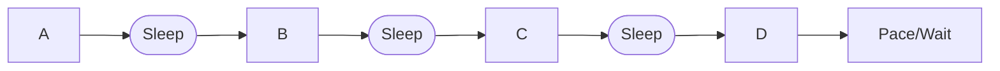

# Workload modeling

It's not enough to know _what_ to test (which pages or endpoints to hit)-- you should also think about _how_ to test. How many virtual users should you simulate? Will those users pause their execution to simulate "think times" of real users? Are they new users, or returning users? The answers to these questions can affect your test results.

The process of **workload modeling** involves determining *how* the load will be applied against the system, and it is essential for a successful load test.

Your workload model is heavily influenced by the situations or scenarios you'd like to test. The closer your load test gets to simulating those circumstances, the more *realistic* it is. Realism could mean simulating peak traffic in production, but it could also mean simulating smaller and more targeted traffic against a particular component of your system.

If your load testing script isn't realistic enough, you may not achieve the expected test throughput, or you may not be exercising the same components of a system that real users hit in production. Unrealistic test scripts and scenarios can lead to inconsistent and inaccurate results. More dangerously, they can create a false sense of confidence in what a system can withstand.

## Challenges in workload modeling

Making scripts and scenarios realistic increases the value a load test can provide. However, that is not an easy task. Increasing the realism of a load test can often increase the amount of time and effort required to create and maintain your test suite. There are also many factors that make human behavior hard to simulate:

1. **Computers are faster than humans**. Automated simulations can be executed at inhuman speeds. A machine does not have to stop and think like a human being, which is a problem when you're trying to simulate real users.
2. **Human behavior is unpredictable**. Sometimes, humans don't do the most logical or reasonable thing. Historical data can help identify exactly how your end users behave and inform your load test's behavior.
3. **User flows can be complex**. As systems grow in scope, the number of user flows that a load test may need to simulate to be realistic has increased as well. A load test may need to cover multiple end-to-end flows, each of which may require different test parameters.
4. **Distributed systems come with multiple points of failure**. Software with event-driven or microservices-based architectures have many modular components, each of which may need to be tested and monitored.
5. **Many systems have multiple traffic sources.** Users' geographical locations, as well as their internet speeds, have an impact on their 

So how can we make automated tests realistic despite these obstacles?

## 

Load test requirements demand that tests mimic real users in particular settings or scenarios. 

- Sometimes, the requirement is to load-test several users interacting with the system.
- Other times, it focuses on generating some throughput volumes per process.
- Or teams may receive just the order to simulate production.

>At times, the requirement may be "just load test it."

Realistic load simulations require concrete inputs and definitions, such as:

- Goal for throughput. Per process and in total.
- If we only receive the total, we will need a percentage per component.
- Goal for Virtual users/threads.
- As mentioned, virtual users are no longer the end-all, be-all. In modern microservice structures, the provided info is the number of needed threads to simulate the throughput.
- Period or duration of the test or load sample.
- This defines the test duration.
 

There are multiple ways that automations try to meet the load test requirements. We will describe different behaviors and types of automations to achieve the required load patterns.

We will go from the smallest and least problematic to the most significant and complex of these options.

  

 

  

### Process-oriented automations

Single service or request to the system has to be load-tested. We automate only one step. Maybe two if the process we want to call requires authentication or something else. We automate the prerequisite (IE., the authentication) to run only once, and then the process in scope. This one will be executed as many times and by as many threads as we need to generate the desired load.

These are the simplest automations. They don't try to simulate a real user with a single script but just one step that the user may do. They are helpful to test a single created or updated process. Each of these automates only one action, paired up with any quick dependencies it may have. IE. Logins or authentications.

Depending on the desired throughput for this single process (and some other variable factors), the team may want/need to use parallel processes or threads (virtual users) to reach the threshold goal in the given period. If the process takes 1 second to respond, and we need to generate ten calls in 5 seconds, a single thread is not enough.

Because of this, we can require that parallel requests simulate the desired threshold. There are some other reasons for wanting to generate the load from multiple threads, like multiple user simulations, credential handlings, etc. 

To simulate a realistic threshold, we need to know two parameters: 

* The number of parallel simulations (virtual users or threads) 
* The number of times each process should execute in the given time.

The time it takes the process to respond is a significant dependency here. As the load increases, the response time of the process may increase too. That is another reason to have multiple threads if the project has not already indicated how many to simulate. 

We need to give some buffer time or "pacing" to accommodate this possible extension in the duration of the process. That pace also helps simulate the action of a real user who doesn't start all over immediately.

So we have a triad of parameters to be defined to simulate the desired load.

- How many threads to use.
- Total threshold to simulate.
- How much to wait per process. (or # of iterations in the duration of the test)

These three parameters are dependent and proportional to each other. We cannot affect one number without impacting the others. This simple equation displays this balance. 

> TotalIterations = NumberOfThreads x IterationsPerThread

As mentioned earlier, the project may have already provided some parameters. But we must keep this proportion in mind.

It remains to be seen how much each process should wait between the iterations or whether the test should indicate the number of desired iterations.

Finding the wait time or pacing needed to simulate the number of desired iterations can be challenging.

The formula is something like the following:

> Wait = (TotalTime - (IterationsPerUser x AvgProcess duration)) / TotalIterations

Crazy amount of calculations for the most accessible type of automation, right? Thankfully k6 does some of this automatically. Please check the workshop section on Load test options or the k6 Executors documentation for more information.


 

  

## Step-flow automations

Whereas process-oriented automations simulate a single step, _Step-flow automations_ simulate a flow of different steps that a human may do when working with the system. 

These automations are losing popularity. Simulating the steps and waits done by an actual human is no longer needed in modern modular and service-oriented applications. The focus is on triggering each service according to average production use or test goals.

Simulating a set of steps in a single VUser was a requirement when there was no clear observability of the utilization of each service when the whole system resided in a monolithic design. The only indication teams had to load test a system was the number of users and vague guidelines to figure out what steps the users did.

Process-flow automations do multiple and different actions, one after the other, in a single script or flow. 

As we mentioned, machine simulations can go much faster than humans can. Humans wait, think, remember, or move their hands slower than the electrons in the silicon board running the simulation.

Hence, we must add wait or sleep times between each of the different steps that the process follows. Automations must simulate the time between each action when humans are idle. The industry commonly calls these Think Time, Sleep, Wait, and many other synonyms. We will refer to them as sleep from now on.

Sleep is different from the pacing time we mentioned earlier. Sleep gives realism to the automation, taking a virtual breath between steps. On the other hand, pacing is a wait after all the steps before re-starting the process. Pacing controls the number of iterations and generates the desired throughput.

For the sleep time between steps, we can configure different waits on each of those pauses. Still, a recommendation is to use a somewhat realistic standard time between each significant step in the automation. Let's say about 5 seconds.

That leaves us with a process flow like the following:



Another detail is that human beings do not wait precisely 5 seconds between steps. Even if that was the requirement, a person could not wait precisely 5 seconds between steps. Only machines have that precision. The automations must add some randomization to that pause, but still somewhat near those 5 seconds. 

Then what's left is to calculate a reasonable wait time at the end of the steps to simulate the desired volumes in a load test. The random stops, the variable time each step takes, and other factors will increase the complexity of simulating the desired load with a flow of steps.

 

  

Again k6 comes to the rescue with the _executors_, which streamline some of these calculations. But in the case of multi-step or E2E automations, it is recommended to add them manually between steps.

## Multiple processes, multiple flows, multiple users

Load tests were considerably complex in the past. 
 
The most common load tests had multiple test cases; each test case or script had a flow of steps simulating a targeted process. We assign to each test script several virtual users and varied load targets for each. *(see 'All together option 1')*

Nowadays, full-scale load tests focus on triggering each targeted process according to what is observed or expected in production. *(see 'All together option 2')*

In both cases, the mixed bag of tasks comes down to defining how many times we should run each process/script, per-thread or virtual user, and how many threads to use for each process.

Getting these numbers right is the core of simulating a realistic full-load scenario.

Again, the first step is to have the total number of actions in the desired period, per process, and a global total.

```
Process TotalxHour

A 10
B 50
C 30
D 20
E 40

TOTAL 150
```

Here we need to know the goal number of virtual users to simulate. That can be defined either from the load test requirement, the number of threads needed to generate the desired total throughput, or the per-process throughput.

  

When the team receives the number of virtual users as a target, we can divide that number between the total throughput goal. That will give us a tremendous approximate pace to give to each process. Let's say we have a goal of 50 total virtual users.

  

```
Iterations per VU = Total iterations/Total VUs

Example: 150/50 = 3
```

  

In the example, each Virtual user would have to iterate three times per hour with the desired throughput and target number of virtual users.

  

As you can see, even if at scale, the proportion between the total number of users, desired throughput, and iterations per vUser stays consistent.

  

 

  

In essence, keeping the proportion of throughput, pacing, and the number of virtual users on a complex load test is critical.

  

 

  

For these situations, k6 has multiple functions that help test creators ease this process, with controls over the times each VUser iterates, or all of the users, or control their injection rate, and many more. For more information, check the k6 executors' documentation.