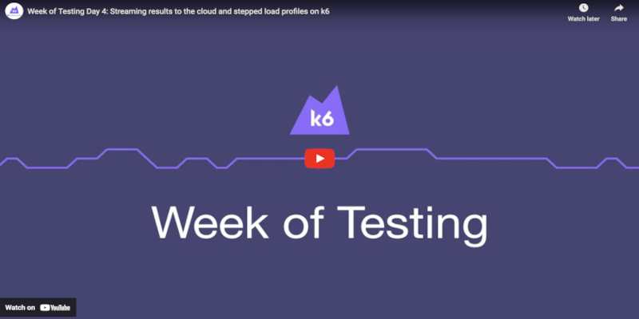

k6 Cloud is an optional service and load testing platform that provides the best experience for running load tests with k6. In this section, you will learn how to integrate k6 OSS with k6 Cloud.

## Using k6 OSS with k6 Cloud

[](https://www.youtube.com/embed/jDmMmc75RRM)

### Sign up for k6 Cloud

k6 Cloud is free (no credit card required) for the first 50 cloud tests, so that's what we're going to use. You will not need a paid account for any of these exercises.

To start, [register for an account here](https://app.k6.io/account/register).

Once you're logged in, go to [the API token page](https://app.k6.io/account/api-token) and copy the token there.

### Allow k6 OSS to access k6 Cloud

On your local machine, where you have k6 OSS installed, enter the following command:

```plain
k6 login cloud --token <token>
```

This will tell your local installation of k6 OSS to use your k6 Cloud account, unlocking additional features. When you use `k6 run test.js`, you'll still be starting tests locally, not on k6 Cloud, but there are other execution options available to you.

## Send output to cloud

The first way to integrate k6 OSS with k6 Cloud is to run your test locally, but send your results to k6 Cloud. The main advantage of this is to have all your test runs in one place, even shakeout or debugging test runs.

To do this, use the following command:

```plain
k6 run test.js -o cloud
```

The `-o` is the same flag we used to output results to different files, but this time, k6 is instead sending the results to k6 Cloud. You'll then see the test running on k6 Cloud - more on how to view those results in k6 Cloud in the next section!

## Run cloud test

Another option available once you've linked your k6 Cloud with k6 OSS is remotely starting an execution on k6 Cloud. 

Try this:

```plain
k6 cloud test.js
```

You'll see output like this:

```plain
nic@sopirulino k6-scripts % k6 cloud test.js

          /\      |‾‾| /‾‾/   /‾‾/   
     /\  /  \     |  |/  /   /  /    
    /  \/    \    |     (   /   ‾‾\  
   /          \   |  |\  \ |  (‾)  | 
  / __________ \  |__| \__\ \_____/ .io

  execution: cloud
     script: test.js
     output: https://app.k6.io/runs/1219824

  scenarios: (100.00%) 1 scenario, 100 max VUs, 4m30s max duration (incl. graceful stop):
           * default: Up to 100 looping VUs for 4m0s over 3 stages (gracefulRampDown: 30s, gracefulStop: 30s)


Run    [--------------------------------------] Initializing
```

Notice the line `execution: cloud`, indicating that while the test was triggered via k6 OSS, the test is actually being executed on k6 Cloud. You'll also see a progress bar to let you know what's happening, along with a [test status code](https://k6.io/docs/cloud/cloud-faq/general-questions/#test-status-codes).

In this situation, k6 will:
- send test artifacts (your test script and test data, if any) to k6 Cloud
- provision instances of k6 in our AWS account
- copy over your test artifacts to each AWS instance
- start the test, sending results back to k6 Cloud

### `-o cloud` or `k6 cloud`?

While both commands utilize an integration between k6 OSS and k6 Cloud, they do fundamentally different things.

`k6 run test.js -o cloud` instructs k6 to run **locally**, but send test results **remotely** to k6 Cloud.

`k6 cloud test.js` instructs k6 to run and store results **remotely** to k6 Cloud.

These commands let you easily switch between execution modes depending on the type of test you're doing.

- Use `k6 run test.js` while you're writing or debugging a script.
- Use `k6 run test.js -o cloud` when you're ready for shakeout tests, or longer tests that you want to run on your own infrastructure.
- Use `k6 cloud test.js` when you want to utilize k6 Cloud infrastructure to run your test, especially if you'd like to ramp up to full-scale tests.

## Test your knowledge

### Question 1

Which of the following do you need to be able to link your k6 Cloud account for use in k6 OSS?

A: The receipt number for your purchase of a k6 Cloud plan

B: Your k6 Cloud account number

C: Your API token

### Question 2

What can you do for free on k6 Cloud?

A: Nothing; using k6 Cloud requires a payment plan

B: Run a test on 50 cloud load generators

C: Run 50 tests on cloud infrastructure

### Question 3

Which of the following commands would NOT send k6 test results to k6 Cloud?

A: `k6 run script.js`

B: `k6 cloud script.js`

C: `k6 run script.js -o cloud`

### Answers

1. C.
2. C.
3. A.