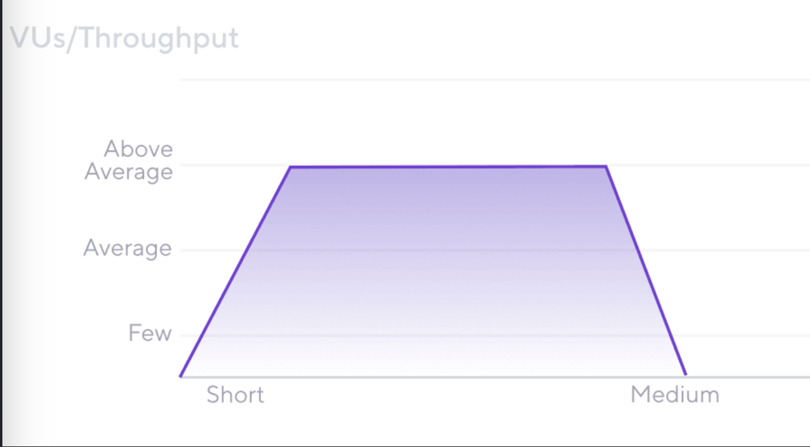

## Load Testing

**Performance testing != Load testing**

---

## Common test parameters

_Test parameters_ include the distribution, shape, and pattern of the load.

- **Virtual users (VUs)**  
- **Iterations**
- **Throughput**
- **User flows**
- **Load profile**
- **Duration**

---

## How to simulate load

1. **Protocol-based load testing**
2. **Browser-based load testing**
3. **Hybrid load testing**

---

## Load test types

### Shakeout test

 
<!-- .element class="stretch" -->

---

### Average load test

<!-- .element class="stretch" -->

---

### Stress test

<!-- .element class="stretch" -->

---

### Soak or endurance test

<!-- .element class="stretch" -->

---

### Spike test

<!-- .element class="stretch" -->

---

### Breakpoint test

<!-- .element class="stretch" -->

---

## Load testing process

  

  ### High level overview

  - Planning for load testing
  - Scripting a load test
  - Executing load tests
  - Analysis of load testing results  

  

  

  

  

---

## k6 OSS

- Move to: [04-getting-started-with-k6-oss](?p=04-getting-started-with-k6-oss)
