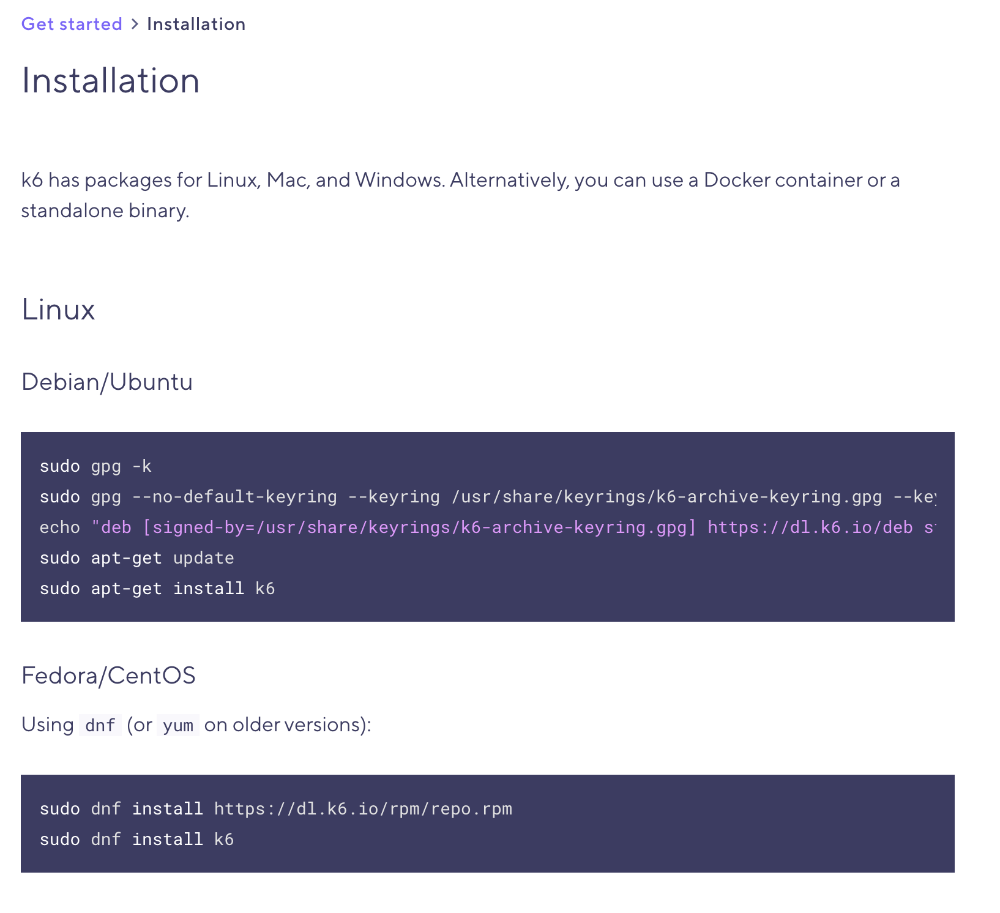

# Get started with k6 OSS

---

## Installation

https://k6.io/docs/getting-started/installation/ 


<!-- .element class="stretch" -->

---

## Writing your first k6 script

- Create a new file named `test.js`, and open it in your favorite IDE.
- Import the HTTP Client from the built-in module `k6/http`:
- Create and export a default function.

```js [1|3-6]
import http from 'k6/http';

export default function () {
  // Any code in the `default` function 
  // is executed by each k6 virtual user when the test runs.
}
```

---

## Writing your first k6 script

Add the logic for making the actual HTTP call:

```js
import http from 'k6/http';

export default function() {
  let url = 'https://httpbin.test.k6.io/post';
  let response = http.post(url, 'Hello world!');

  console.log(response.json().data);
}
```

---

## Writing your first k6 script

Alternatively, you can also run `k6 new [filename]` to automatically create a file with the basic boilerplate to get you up and running quickly. 😉

---

## Hello World: running your k6 script

Run the command below on a terminal:

```js
k6 run test.js
```

---

You should get something like this:

```shell
$ k6 run test.js

          /\      |‾‾| /‾‾/   /‾‾/
     /\  /  \     |  |/  /   /  /
    /  \/    \    |     (   /   ‾‾\
   /          \   |  |\  \ |  (‾)  |
  / __________ \  |__| \__\ \_____/ .io

  execution: local
     script: test.js
     output: -

  scenarios: (100.00%) 1 scenario, 1 max VUs, 10m30s max duration (incl. graceful stop):
           * default: 1 iterations for each of 1 VUs (maxDuration: 10m0s, gracefulStop: 30s)

INFO[0001] Hello world!                                  source=console

running (00m00.7s), 0/1 VUs, 1 complete and 0 interrupted iterations
default ✓ [======================================] 1 VUs  00m00.7s/10m0s  1/1 iters, 1 per VU

     data_received..................: 5.9 kB 9.0 kB/s
     data_sent......................: 564 B  860 B/s
     http_req_blocked...............: avg=524.18ms min=524.18ms med=524.18ms max=524.18ms p(90)=524.18ms p(95)=524.18ms
     http_req_connecting............: avg=123.28ms min=123.28ms med=123.28ms max=123.28ms p(90)=123.28ms p(95)=123.28ms
     http_req_duration..............: avg=130.19ms min=130.19ms med=130.19ms max=130.19ms p(90)=130.19ms p(95)=130.19ms
       { expected_response:true }...: avg=130.19ms min=130.19ms med=130.19ms max=130.19ms p(90)=130.19ms p(95)=130.19ms
     http_req_failed................: 0.00%  ✓ 0        ✗ 1
     http_req_receiving.............: avg=165µs    min=165µs    med=165µs    max=165µs    p(90)=165µs    p(95)=165µs
     http_req_sending...............: avg=80µs     min=80µs     med=80µs     max=80µs     p(90)=80µs     p(95)=80µs
     http_req_tls_handshaking.......: avg=399.48ms min=399.48ms med=399.48ms max=399.48ms p(90)=399.48ms p(95)=399.48ms
     http_req_waiting...............: avg=129.94ms min=129.94ms med=129.94ms max=129.94ms p(90)=129.94ms p(95)=129.94ms
     http_reqs......................: 1      1.525116/s
     iteration_duration.............: avg=654.72ms min=654.72ms med=654.72ms max=654.72ms p(90)=654.72ms p(95)=654.72ms
     iterations.....................: 1      1.525116/s

```

---

## k6 CLI

- Move to: [05-the-k6-cli](?p=05-the-k6-cli)
