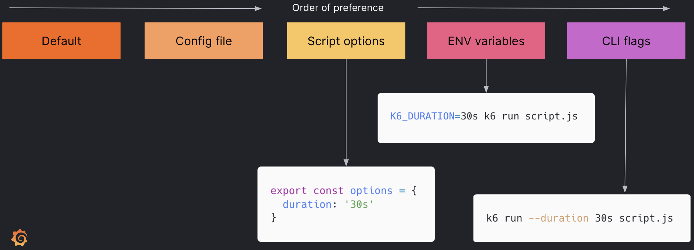

# The k6 CLI

---

## Commands

The three most common commands are:

| Command   | Description                    | Usage            |
| --------- | ------------------------------ | ---------------- |
| `help`    | Displays all possible commands | `k6 help`        |
| `run`     | Executes a k6 script           | `k6 run test.js` |
| `version` | Displays installed k6 version  | `k6 version`     |

---

## Flags

| Flag                   | Description                                                    | Usage                                    |
| ---------------------- | -------------------------------------------------------------- | ---------------------------------------- |
| `--help`               | Displays possible flags for the given command                  | `k6 run --help`                          |
| `--vus` or `-u`        | Sets number of virtual users                                   | `k6 run test.js --vus 10 --duration 30s` |
| `--duration`           | Sets the duration of the test                                  | `k6 run test.js --duration 10m`          |

---

| Flag                   | Description                                                    | Usage                                    |
| ---------------------- | -------------------------------------------------------------- | ---------------------------------------- |
| `--iterations` or `-i` | Instructs k6 to iterate the default function a number of times | `k6 run test.js -i 3`                    |
| `-e`                   | Sets an environment variable to pass to the script             | `k6 run test.js -e DOMAIN=test.k6.io`                           

---

## Getting help: `help`

Running `k6 help` returns the following:

```shell
          /\      |‾‾| /‾‾/   /‾‾/
     /\  /  \     |  |/  /   /  /
    /  \/    \    |     (   /   ‾‾\
   /          \   |  |\  \ |  (‾)  |
  / __________ \  |__| \__\ \_____/ .io

Usage:
  k6 [command]

Available Commands:
  archive     Create an archive
  cloud       Run a test on the cloud
  convert     Convert a HAR file to a k6 script
  help        Help about any command
  inspect     Inspect a script or archive
  login       Authenticate with a service
  pause       Pause a running test
  resume      Resume a paused test
  run         Start a load test
  scale       Scale a running test
  stats       Show test metrics
  status      Show test status
  version     Show application version

Flags:
  -a, --address string      address for the api server (default "localhost:6565")
  -c, --config string       JSON config file (default "/Users/nic/Library/Application Support/loadimpact/k6/config.json")
  -h, --help                help for k6
      --log-output string   change the output for k6 logs, possible values are stderr,stdout,none,loki[=host:port] (default "stderr")
      --logformat string    log output format
      --no-color            disable colored output
  -q, --quiet               disable progress updates
  -v, --verbose             enable verbose logging

Use "k6 [command] --help" for more information about a command.
```

---

## Execution and Execution Options: `run`

Another common k6 command is `k6 run [filename].js`.

---

### The duration flag

The duration specifies how long the test executes for. You can set this on the command line with the flag `--duration`:

```shell
k6 run test.js --duration 30s
```

You can use `s`, `h`, and `m` to define the duration.

---

### The iterations flag

You can set the number of iterations with the `--iterations` or `-i` flag, like this:

```shell
k6 run test.js --iterations 100
k6 run test.js -i 100
```

---

### Virtual user flags

You can adjust the number of virtual users with the `-u` or `--vus`s flag when running the test:

```shell
k6 run test.js --vus 10 --duration 1m
k6 run test.js -u 10 --iterations 100
```

---

### Environment variables

To use an environment variable, define the variable in your script:

```js [3|5-7]
import http from 'k6/http';

const hostname = `http://${__ENV.DOMAIN}`;

export default function () {
    let res = http.get(hostname + '/my_messages.php');
}
```

---

Here's how to do define it during runtime:

```shell
k6 run test.js -e DOMAIN=test.k6.io
```

---

## Changing settings in k6

k6 always [prioritizes settings](https://k6.io/docs/using-k6/k6-options/how-to/#order-of-precedence) in this order:


<!-- .element class="stretch" -->

---

## Understanding k6 results

- Move to: [06-understanding-k6-results](?p=06-understanding-k6-results)

