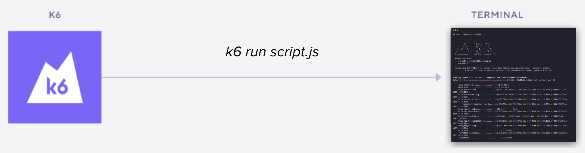
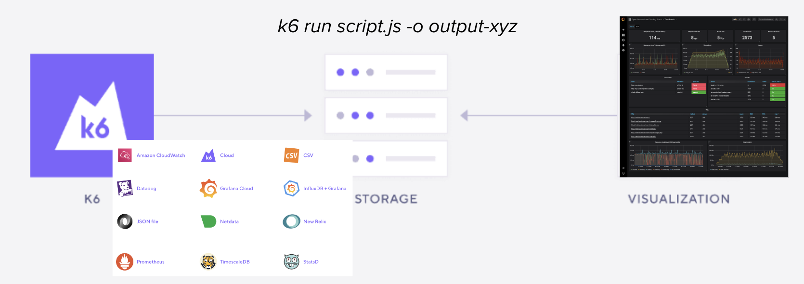
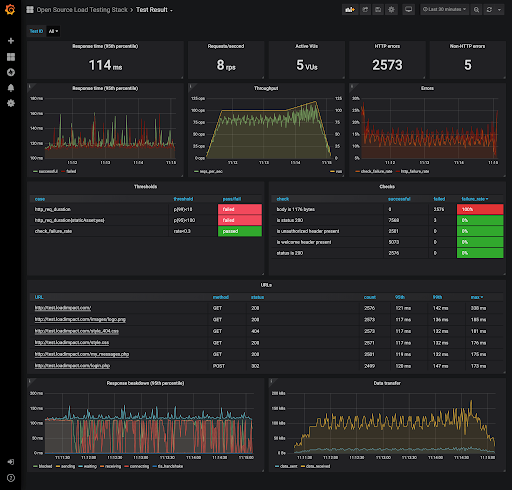

# k6 results

---

## What we have done so far



---

## The output option



---

### Saving k6 results as a CSV

```shell
k6 run test.js -o csv=results.csv
```

> 💡 You can also use `--out` instead of `-o`.

---

### CSV results output format

```csv
metric_name,timestamp,metric_value,check,error,error_code,expected_response,group,method,name,proto,scenario,service,status,subproto,tls_version,url,extra_tags
http_reqs,1641298536,1.000000,,,,true,,POST,https://httpbin.test.k6.io/post,HTTP/1.1,default,,200,,tls1.2,https://httpbin.test.k6.io/post,
http_req_duration,1641298536,114.365000,,,,true,,POST,https://httpbin.test.k6.io/post,HTTP/1.1,default,,200,,tls1.2,https://httpbin.test.k6.io/post,
http_req_blocked,1641298536,589.667000,,,,true,,POST,https://httpbin.test.k6.io/post,HTTP/1.1,default,,200,,tls1.2,https://httpbin.test.k6.io/post,
http_req_connecting,1641298536,117.517000,,,,true,,POST,https://httpbin.test.k6.io/post,HTTP/1.1,default,,200,,tls1.2,https://httpbin.test.k6.io/post,
http_req_tls_handshaking,1641298536,415.043000,,,,true,,POST,https://httpbin.test.k6.io/post,HTTP/1.1,default,,200,,tls1.2,https://httpbin.test.k6.io/post,
http_req_sending,1641298536,0.251000,,,,true,,POST,https://httpbin.test.k6.io/post,HTTP/1.1,default,,200,,tls1.2,https://httpbin.test.k6.io/post,
http_req_waiting,1641298536,114.010000,,,,true,,POST,https://httpbin.test.k6.io/post,HTTP/1.1,default,,200,,tls1.2,https://httpbin.test.k6.io/post,
http_req_receiving,1641298536,0.104000,,,,true,,POST,https://httpbin.test.k6.io/post,HTTP/1.1,default,,200,,tls1.2,https://httpbin.test.k6.io/post,
http_req_failed,1641298536,0.000000,,,,true,,POST,https://httpbin.test.k6.io/post,HTTP/1.1,default,,200,,tls1.2,https://httpbin.test.k6.io/post,
checks,1641298536,1.000000,Application says hello,,,,,,,,default,,,,,,
vus,1641298536,2.000000,,,,,,,,,,,,,,,
vus_max,1641298536,100.000000,,,,,,,,,,,,,,,
```

---

### Saving k6 results as a JSON

```shell
k6 run test.js -o json=results.json
```

### JSON results output format

```JSON
{"type":"Metric","data":{"name":"http_reqs","type":"counter","contains":"default","tainted":null,"thresholds":[],"submetrics":null,"sub":{"name":"","parent":"","suffix":"","tags":null}},"metric":"http_reqs"}
{"type":"Point","data":{"time":"2022-01-05T12:46:23.603474+01:00","value":1,"tags":{"expected_response":"true","group":"","method":"POST","name":"https://httpbin.test.k6.io/post","proto":"HTTP/1.1","scenario":"default","status":"200","tls_version":"tls1.2","url":"https://httpbin.test.k6.io/post"}},"metric":"http_reqs"}
{"type":"Metric","data":{"name":"http_req_duration","type":"trend","contains":"time","tainted":null,"thresholds":["p(95)<=100"],"submetrics":null,"sub":{"name":"","parent":"","suffix":"","tags":null}},"metric":"http_req_duration"}
{"type":"Point","data":{"time":"2022-01-05T12:46:23.603474+01:00","value":118.96,"tags":{"expected_response":"true","group":"","method":"POST","name":"https://httpbin.test.k6.io/post","proto":"HTTP/1.1","scenario":"default","status":"200","tls_version":"tls1.2","url":"https://httpbin.test.k6.io/post"}},"metric":"http_req_duration"}
{"type":"Metric","data":{"name":"http_req_blocked","type":"trend","contains":"time","tainted":null,"thresholds":[],"submetrics":null,"sub":{"name":"","parent":"","suffix":"","tags":null}},"metric":"http_req_blocked"}
```

---

## Grafana Cloud k6


<!-- .element class="stretch" -->

---

## Let's wrap this up!

- Move to [end](?p=end)
